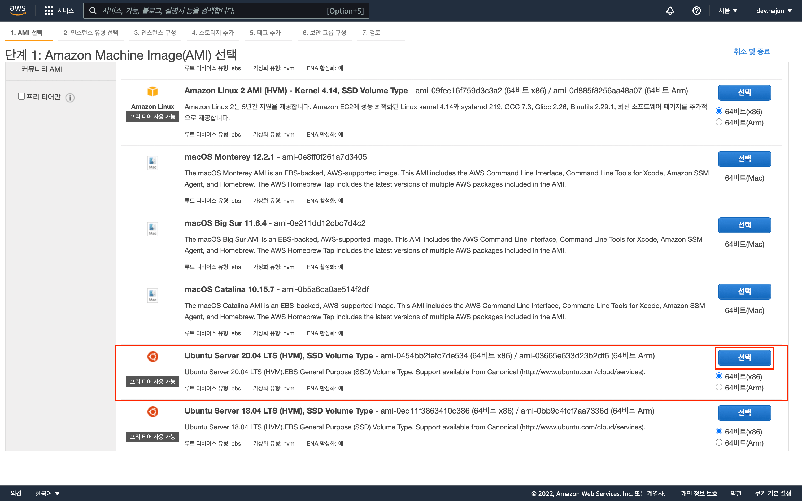

# EC2 + Github Actions로 Next.js 배포 및 자동화(CI/CD) - 1편: AWS EC2 생성 및 설정

배포 과정에 대한 글이니 Next.js나 AWS에 대한 설명은 생략하겠다.  
1편은 Next서버가 구동 될 EC2 인스턴스를 생성 및 설정하는 과정이다.

## EC2 인스턴스 생성

---

### Step1


인스턴스 생성 전 우측 상단에서 사용 할 지역을 설정해준다.  
해당글은 서울 리전(ap-northeast-2)으로 설정 후 진행 할 것이다.

지역을 설정해주었다면 EC2 대시보드에 접근한 후 인스턴스 시작 버튼을 클릭한다.

---

### Step2




원하는 OS에서 선택 버튼을 눌러 다음 단계로 넘어간다.

프리티어를 사용할것이기 떄문에 t2.micro 유형을 선택 후 검토 및 시작을 누른다.

> 이 글에서는 프리티어 기준으로 설명하지만. 혹시 프리티어를 사용하는게 아니라면 가성비가 더 좋은 t3a나 t4g인스턴스를 선택해도 상관없다.

---

### Step3


인스턴스에 Next App을 배포 후 Http 또는 Https로 접근해야하기 때문에 보안그룹 편집으로 접근해 80포트와 443포트에 대해 퍼블릭하게 접근 가능하게끔 설정해준다.

그 후 검토 및 시작 버튼을 눌러 다시 인스턴스 시작 검토 단계로 돌아간다.

> 만약 도메인을 구매해 https까지 붙히지 않을거라면 80포트만 허용해줘도 상관없다.

---

### Step4


태그 편집 버튼을 누룬다.

키 항목에 원하는 값을 넣어준다. 이 글에서는 `CodeDeploy-Instance`로 사용하겠다.

이 키 항목은 추후 배포 자동화를 위해 CodeDeploy에서 tag group을 지정하는데 이때 방금 설정한 EC2인스턴스의 tag의 키 항목과 매칭시켜 줄 것이다.
CodeDeploy에 정의한 동작이 tag로 매칭된 EC2인스턴스에 실행되는것이다.

키 항목에 원하는 값을 채워넣었다면 검토 및 시작 버튼을 누른다.

> 키 항목 우측의 값 항목은 따로 추가해주지 않아도 된다.

---

### Step5


시작하기 버튼을 누른다.

---

### Step6


해당 인스턴스에 SSH로 접근하기 위한 .pem 키를 발급받는다.

기존에 사용하던 키페어가 있다면 기존 키 페어를 사용해도 좋다.

> 키 페어는 분실하게 되면 아주 곤란하니 다운로드 받아 잘 보관하도록 하자

---

### Step7


(선택사항) EC2인스턴스를 그냥 사용하게 되면 IP가 동적으로 변경되게 된다. 만약 도메인을 할당해 사용한다면 필수적으로 탄력적 IP를 할당받아 인스턴스에 적용 시켜줘야한다. 일단 네트워크 및 보안 > 탄력적 IP 메뉴에 진입하여 탄력적 IP를 할당받자.

---

### Step8


위에서 할당받은 IP를 생성한 EC2 인스턴스에 연결시켜주자.

이렇게 되면 EC2 인스턴스에 고정 IP 할당이 완료된것이다.

주의할 점은 인스턴스를 중지 혹은 종료한 후에 탄력적 IP를 릴리즈해주지 않으면 비용이 청구되니 사용하지 않는다고 판단이 되면 꼭 릴리즈를 시켜주자.

---

### Step9

인스턴스를 만들때 발급받은 .pem키를 이용해 SSH로 터미널을 통해 인스턴스에 접근해보자.

필자는 보통 pem키를 ~/.ssh폴더에 모아놓고 관리하기 때문에 일단 ssh폴더로 다운받은 pem키를 이동시키겠다.

```shell
mv  ~/Downloads/ap2-key-pair.pem ~/.ssh
```

그리고 pem키를 소유자만 Read 할 수 있게끔 권한설정을 해주자.

```shell
chmod 400 ~/.ssh/ap2-key-pair.pem
```

그 후 pem키를 이용하여 EC2 인스턴스의에 접근해보자.

```shell
ssh -i ~/.ssh/ap2-key-pair.pem ubuntu@3.39.127.148
```

`ubuntu@` 뒤의 IP 주소는 아까 할당받아 연결한 탄력적 IP주소를 적어준다.


잘 접속이 되었다면 위와 같은 화면을 만날 수 있을것이다.

---

### Step10

아직 자세히 설명하진 않았지만 조금 이따 사용 될 CodeDeploy 에이전트를 설치 해야한다. 아래 명령어를 접속한 인스턴스의 터미널에 입력해보자.

> 아래 명령어는 ubuntu 20.24버전 기준으로 작성되었으니 만약 버전이 다를 경우엔 [Ubuntu Server용 CodeDeploy 에이전트 설치](https://docs.aws.amazon.com/ko_kr/codedeploy/latest/userguide/codedeploy-agent-operations-install-ubuntu.html) 공식문서를 참고하자.

```shell
sudo apt update && sudo apt upgrade
sudo apt install ruby-full
sudo apt install wget
cd /home/ubuntu
wget https://aws-codedeploy-ap-northeast-2.s3.ap-northeast-2.amazonaws.com/latest/install
chmod +x ./install
sudo ./install auto > /tmp/logfile
```


```shell
sudo service codedeploy-agent status
```

해당 명령어를 입력했을때 위 사진같이 active(running) 상태가 나온다면 EC2 인스턴스에 CodeDeploy 에이전트의 설치는 끝난것이다.

---

### Step11

이제 다시 AWS로 돌아가 EC2 인스턴스에 IAM 설정을 해야 한다.


IAM 서비스를 검색하여 접근 후 역할 메뉴에서 역할 만들기 버튼을 누른다.
그리고 신뢰할 수 있는 엔터티 유형에서 AWS 서비스를 선택 후 사용 사례를 EC2를 선택해준다.
그리고 다음 버튼을 눌러준다.

그 후 권한 추가를 해줄것이다.


검색을 이용하여 AWSCodeDeployFullAccess, AmazonS3FullAccess 권한을 추가해준 후 다음 버튼을 눌러준다.


마지막으로 역할의 이름을 지정해주고 설정한 서비스와 권한을 확인해준 후 역할 생성 버튼을 눌러준다.

---

### Step12

이제 생성된 IAM role을 EC2인스턴스에 적용시켜주자.

> 혹시 EC2에 접근했는데 인스턴스가 보이지 않는다면 우측 상단의 지역 설정이 제대로 되어있는지 확인해보자.


생성한 인스턴스의 IAM역할 수정 메뉴에 접근하여 방금 만든 `ec2-iam` role을 선택해준 후 저장 버튼을 눌러준다.

이로써 Next App을 배포 할 EC2 생성 및 설정이 끝났다.

다음으로는 Github Actions에서 Build된 파일을 EC2로 보내주기 전 해당 파일을 저장해줄 AWS S3 설정을 해볼것이다.

---

> 현재 EC2 + Github Actions로 Next.js 배포 및 자동화(CI/CD) - 2편: AWS S3 생성 및 설정 글을 작성중입니다.
