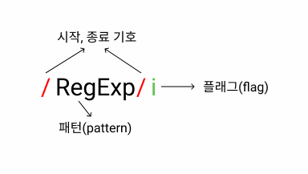

# RegExp

## 정규 표현식이란

정규 표현식은 일정한 패턴을 가진 문자열의 집합을 표현하기 위해 사용하는 형식 언어이다. 정규 표현식은 자바스크립트 고유 문법이 아니고 대부분의 프로그래밍 언어와 코드 에디터에 내장되어 있다.

하지만 모든 프로그래밍 언어나 에디터의 정규표현식이 같은것은 아니다. 정규 표현식에도 종류를 크게 두 가지로 나누자면 표준으로 인정된 [POSIX의 정규 표현식](https://namu.wiki/w/POSIX)과 그 확장판이라고 볼 수 있는 [Perl](https://namu.wiki/w/Perl)의 [PCRE](http://www.pcre.org/)가 있다. 그 중에서 자바스크립트는 ES3부터 Perl방식을 도입하여 사용되고 있다.

그리고 에디터의 경우로 들어가보면 Emacs와 Vim은 자체적인 정규표현식을 지원하고 있다. 하지만 이 모든것들이 완전히 문법이 다르지 않고 비슷하면서 조금씩 다른 부분이 있는것이기 때문에 자바스크립트에서 Perl방식으로 공부하여도 다른 언어나 에디터를 사용할때는 어떤 정규표현식 방식을 사용하고 있는지 확인한 후 사용해줘야 하는 불편함도 존재한다.

## 정규 표현식을 왜 써야할까?

정규표현식은 사람이 그냥 읽기에는 아주 난해한데 문법 자체가 조금만 복잡해져도 각종 특수문자가 많이 쓰이기 때문이다. 그래서 많은 개발자들이 거부감을 가지고 아예 손을 대지 않으려는 경향도 있는것 같다. 하지만 그때그때 달라지는 문자열을 처리 하는 로직을 정교하게 짜주려고 하는것보다 차라리 정규표현식을 배우는게 여러모로 낫다는 의견도 있다.

예를 들어 사용자로부터 휴대폰 번호를 받아야하는데 당연히 대한민국 기준으로는 아래와 같은 형식으로 받아야 할 것이다.

```
010-1234-5678
```

하지만 입력하는 도중 실수를 할 수도 있고 고의로 틀린 정보를 유저가 입력할 수도 있다. 그렇기때문에 휴대폰 번호의 형식을 제한시켜야 하는데 정규표현식을 사용하지 않으면 유저에게 받은 휴대폰 번호를 `-` 단위로 split하여 문자열의 갯수를 체크하고 그것이 0~10사이의 숫자인지도 체크해주는 함수같은것을 구구절절하게 만들어줘야 할 것이다.

하지만 정규표현식을 사용하면 아래와 같이 간단하게 표현하고 확인할 수 있다.

```javascript
const krPhoneRegExp = /^\d{3}-\d{4}-\d{4}$/;
krPhoneRegExp.test('010-1234-5678'); // true
krPhoneRegExp.test('010-1234-오육78'); // false
```

물론 코드의 양으로 봤을때는 간단하지만 사람이 읽기에는 가독성이 썩 좋아보이지는 않는다. 하지만 일일히 함수를 작성하여 문자열 하나하나 뜯어보며 if문을 작성하여 비교하는것 보다 정규표현식에 대한 이해도를 키워 저 정도 유효성 검사는 간단하게 구현할 수 있고 남이 쓴 정규표현식도 읽을 수 있으면 아주 유용할것 같다.

## 정규 표현식의 생성

정규 표현식 객체를 생성하기 위해서는 정규 표현식 리터럴 또는 RegExp 생성자 함수를 사용할 수 있다. 일반적으로는 정규 표현식 리터럴로 많이 사용한다. 정규 표현식 리터럴은 아래와 같은 구조를 가진다.



이처럼 정규 표현식 리터럴은 시작과 종료 기호, 패턴, 플래그로 구성이 된다.

### 시작, 종료 기호

`/` 를 사용하여 정규표현식 리터럴의 시작과 종료를 나타내준다, 종료 기호 뒤에는 플래그가 올 수 있다.

### 패턴(pattern)

정규표현식의 형식을 지정해주는 pattern을 작성해주는곳이다.

### 플래그(flag)

정규표현식에 대한 테스트 결과에 영향을 줄 수 있는 옵션같은것이다. 그렇기 때문에 선택적으로 붙혀 사용할 수 있다. (아예 없어도 된다는 말)
Perl형식의 정규표현식은 총 6개의 플래그를 지원한다.

- `i` : 대, 소문자 구분 없이 검색한다.

```javascript
const regExp = /a/;
const regExpI = /a/i;

regExp.test('A'); // false
regExpI.test('A'); // true
```

- `g` : 패턴과 일치하는 모든것들을 찾는다. `g` 플래그가 없다면 패턴과 일치하는 첫 번째 결과만 반영된다.

```javascript
const str = '010일이삼사5678';

str.match(/\d/); // ['0']
str.match(/\d/g); // ['0', '1', '0', '5', '6', '7', '8']
```

- `m` : 다중 행 모드(multiline mode)를 활성화 한다. 다중 행 모드는 `^` 와 `$`의 작동 방식에만 영향을 준다.

```javascript
const str = `1은 1이다.
2는 2다.
3은 3이다.`;

str.match(/^\d/g); // ['1']
str.match(/^\d/gm); // ['1', '2', '3']
```

템플릿 리터럴로 작성한 문자열에서의 개행은 실제로는 `\n` 으로 개행문자가 들어가기 때문에 `m` flag와 `^` 패턴을 같이 사용하게 되면 정규표현식이 작동할때 `\n` 의 뒤에 위치하는 문자열을 포함시킨다.
반대로 `$` 기호를 사용하게 되면 `\n` 의 앞에 위치하는 문자열과 가장 마지막 문자열까지 포함하여 정규표현식을 작동시킨다.

```javascript
const str = `1은 1이다
2는 2이다
3은 3이다`;

str.match(/다$/g); // ['다']
str.match(/다$/gm); // ['다', '다', '다']
```

조금 변형하여 가장 마지막 문자열을 포함시키지 않으려면 `$` 가 아닌 `\n` 을 사용해줄 수도 있다. 그리고 사실 개행 문자까지 포함시키면 m플래그가 필요없다. 그리고 결과값에 `\n` 까지 포함되기 때문에 그리 유용해 보이진 않는다.

```javascript
const str = `1은 1이다
2는 2다
3은 3이다`;

str.match(/다\n/g); // ['다\n', '다\n']
```

- `s` : `.` 이 개행 문자 `\n` 도 포함되도록 `dotall` 모드를 활성화한다.
  s플래그에 대한 설명을 이해하려면 정규표현식에서 `.` 이 어떻게 쓰이는지 알아야한다.
  `.` 은 개행문자를 제외한 모든 문자열과 일치하는 패턴이다. 그래서 아래와 같은 결과가 나온다.

```javascript
const regExpDot = /./;
regExpDot.test('Z'); // true
regExpDot.test('가'); // true

const regExpCss = /CS.3/;
regExpCss.test('CSS3'); // true
regExpCss.test('CS-3'); // true
regExpCss.test('CS 3'); // true -> 공백도 문자열이다.
regExpCss.test('CS\n3'); // false
regExpCss.test(`CS
3`); // false -> 실제로는 'CS\n3' 라고 쓴 것과 같다.
```

위 예제에서 마지막 두개의 예제를 보면 `.` 패턴을 사용해도 개행문자는 포함되지 않기 때문에 모든 문자열과 일치시키는 패턴을 쓰려는 의도와 다르게 작동했다. 이때 `s` 플래그를 사용해주면 정말 모든 문자열과 매칭되는 패턴을 사용할 수 있게 된다.

```javascript
const regExpCss = /./s;

regExpCss.test('CS\n3'); // true
regExpCss.test(`CS
3`); // true
```

하지만 [can i use](https://caniuse.com/?search=dotall)에서 검색해보면 IE에서는 아예 지원이 되지 않는다. 크로스 브라우징을 해야 하는 경우에는 아래와 같은 방법을 사용해보도록 하자.

```javascript
const regExp = /CS[\s\S]3/;
regExp.test('CS-3'); // true
regExp.test('CS\n3'); // true
regExp.test(`CS
3`); // true
```

- `u` : 유니코드 전체를 지원한다. `u` 플래그를 사용하면 surrogate pair를 올바르게 처리할 수 있다. 그리고 유니코드 프로퍼티를 통한 검색이 가능해진다.
  일단 자바스크립트 문자열이 유니코드와 어떤 연관이 있는지 알아보자.
  자바스크립트 문자열은 유니코드 인코딩 중 UTF-16방식을 사용한다. 그래서 일반적으로는 문자열 하나 당 2바이트의 유니코드로 인코딩되는데 2바이트는 최대 65,536개의 문자열만 표현이 가능하고 당연히 특수문자나 이모지 등의 특수문자까지 표현하기에는 부족한 갯수이다. 그래서 특수문자나 이모지 등의 문자열은 예외적으로 4바이트로 처리하는데 아래의 예제에서 재밌는 사실을 알 수 있다.

```javascript
'🥰'.length; // 2 -> 이모지는 4바이트로 인코딩 되는데 2바이트 당 length 1로 인식된다.
'𝒳'.length; // 2 -> 특수문자 또한 마찬가지다.
```

2바이트로 표현하지 못하는 문자열의 length를 찍어보면 2가 나오는데 분명 하나의 글자를 표현한것이라 올바르지 않은 결과가 나오는데 이런 문자열을 [서로게이트 쌍(Surrogate Pair)](https://ko.javascript.info/string#ref-301) 이라고 한다. 쉽게 UTF-16의 유니코드 2개를 활용하여 하나의 문자열을 표현하는것이라고 보면 편하다.
그래서 실제 정규표현식에 `u` 플래그를 사용하지 않고 서로게이트 쌍 문자열을 처리하려고 하면 정상적으로 작동하지 않는 경우도 있다. (테스트 해보니 이모지 등은 잘 작동하지만 오류의 가능성이 있다고 함)
그래서 보통 유니코드 프로퍼티를 이용한 검색을 위해 사용된다. 유니코드 프로퍼티는 패턴에 `\p{조건}` 을 작성해주는식으로 사용할 수 있다.
간단한 예시를 살펴보자. `\p{L}` 는 유니코드 중 문자만을 검색하는 프로퍼티 검색이다.

```javascript
const str = 'A ბ ㄱ';

str.match(/\p{L}/gu); // ['A', 'ბ', 'ㄱ']
str.match(/\p{L}/g); // null ('u' 플래그가 없어서 일치 결과 없음)
```

유니코드 프로퍼티에 관심이 있다면 아래 링크를 참고해보면 좋을것 같다.
[유니코드 프로퍼티\p{...}](https://ko.javascript.info/regexp-unicode#ref-304)

- `y` : 문자 내 특정 위치에서 검색을 진행하는 `sticky` 모드를 활성화 시킨다.
  정규표현식 인스턴스에서는 lastIndex라는 프로퍼티가 존재한다. 이것을 이용해서 특정 index에 위치한 문자열만 검색할 수 있다.

```javascript
const str = 'Have a nice day!';
// index => 0123456789012345

// Sticky 정규식
const stickyRegexp = /nice/y;
stickyRegexp.lastIndex = 3;

str.match(stickyRegexp);
// null -> str의 3번째 index에는 nice라는 문자열이 존재하지 않는다.

stickyRegexp.lastIndex = 7;

str.match(stickyRegexp);
// ["nice", index: 7, input: "Have a nice day!", groups: undefined]
// str의 7번째 index에는 nice라는 문자열이 존재하기 때문에 검색에 성공했다.

str.match(stickyRegexp);
// null -> 하지만 lastIndex 프로퍼티는 1회성이다.
stickyRegexp.lastIndex;
// 0 -> 그렇기 때문에 한번 사용하면 0으로 초기화 된다.
```
