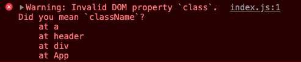
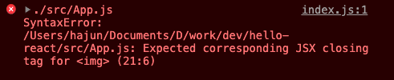

# JSX

## JSX란?
JSX는 자바스크립트의 확장 문법이다. HTML과 매우 비슷하게 생겼다.  
코드를 보면 XML형식이지만 실제로는 JavaScript 객체이며, 용도와 문법도 조금씩 차이가 난다.

HTML코드를 문자열 처럼 쓴 JSX
```jsx
function App() {
  return (
    <div>
      Hello <b>react</b>
    </div>
  );
}
```

JSX는 정식 자바스크립트 문법은 아니다. 리액트로 프로젝트를 개발할 때 사용되는 문법이고 실제로 브라우저에 렌더링 될때는 바벨을 통해 자바스크립트 문법으로 변경된다.

위 코드를 바벨로 트랜스파일링 하면 아래와 같은 자바스크립트 코드가 된다.

```js
function App() {
  return React.createElement(“div“, null, “Hello “, React.createElement(“b“, null, “react“));
}
```

JSX와 비교했을때 한눈에 딱 보면 어떤 구조의 HTML이 만들어질지 예상할 수 없다. 만약 컴포넌트를 정의할때마다 JSX 코드를 작성하는것이 아닌 위 코드처럼 작성해야 한다면 가독성과 유지보수성이 모두 떨어지게 될 것이다.

## JSX의 장점

### 가독성과 편의성
JSX 문법은 아주 직관적으로 컴포넌트를 정의하여 UI를 렌더링할 수 있게 도와준다.  
일반 자바스크립트 코드와 비교하면 한눈에 봐도 JSX를 사용하는것이 가독성이 더 높고 사용하기도 쉽다는것을 알 수 있다.  
JavaScript에서 마치 HTML코드를 작성하는것과 비슷한 형태를 가졌기 때문이다.  
만약 JavaScript에서 createElement와 fragment를 이용하여 DOM을 조작해봤다면 그 코드가 얼마나 길고 복잡성이 높은지 알 것이다.

### 높은 활용도
일반적인 HTML 태그들뿐만이 아니라 개발자가 만든 컴포넌트도 JSX안에서 사용할 수 있다. 마치 사용자 정의 태그를 만들어 사용하는것처럼 말이다. 그래서 각각의 컴포넌트들을 정의하고 코드 몇 글자로 원하는때에 원하는 위치에 렌더링 시킬 수 있다.

## JSX 문법
JSX를 올바르게 사용하려면 몇 가지 규칙을 준수해야 한다.

### 2개 이상의 요소는 부모요소가 필요하다.
컴포넌트에 2개 이상의 요소가 있다면 반드시 부모 요소 하나로 감싸줘야한다.  
왜냐하면 Vitual DOM에서 컴포넌트의 변화를 감지해 낼 때 효율적으로 비교하기 위해 컴포넌트 내부는 하나의 DOM 트리 구조로 이루어져야 한다는 규칙이 있기 때문이다.  
하지만 이런 규칙을 지키다보면 되면 실제로 브라우저에 렌더링될때 HTML에 의미없는 태그들이 추가되며 HTML태그들의 논리적인 구조가 무너질 수 있다.  
이럴때 사용할 수 있는것이 Fragment이다. JSX는 정식 자바스크립트 문법은 아니지만 JavaScript의 기능을 모두 담고 있다.  

Fragment는 아래와 같이 작성한다.
```jsx
function App() {
  return (
    <Fragment>
      <h1>Hello</h1>
      <h2>React!</h2>
    </Fragment>
  );
}
```

혹은 그냥 빈 태그를 작성함으로써 Fragment를 사용할 수 있다.
```jsx
function App() {
  return (
    <>
      <h1>Hello</h1>
      <h2>React!</h2>
    </>
  );
}
```

### JavaScript 표현식 사용
JSX안에서 JavaScript 표현식을 사용할 수 있다. 표현식이란 값으로 평가될 수 있는 문이다. 사용법은 JSX 내부에서 표현식을 중괄호 `{ }`로 감싸주면 된다.

```jsx
function App() {
  const name = 'React';
  return (
    <>
      <h1>Hello</h1>
      <h2>{name}!</h2>
    </>
  );
}
```

#### 삼항 연산자
JSX안에서는 if문을 사용할 수 없다. 표현식은 값으로 평가될 수 있는 문이라고 했다. 하지만 if문은 표현식이 아니고 그렇기 때문에 JSX안에서 조건식을 사용하려면  삼항 연산자를 사용해야 한다.
```jsx
function App() {
  const name = 'React';
  return (
    <div>
      {name === ‘React‘ ? (
        <h1>Hello React!</h1>
      ) : (
        <h2>bye React...</h2>
      )}
    </div>
  );
}
```

#### AND 연산자(&&)를 이용한 단축평가로 조건부 렌더링
위와 같은 경우는 결과 값이 turthy한 값일때와 falsy한 값 일때 각각 렌더링 할 내용이 있다. 하지만 만약 falsy한 값인 경우 렌더링을 하지 않아야 한다면 위와 같이 삼항 연사자를 사용하는것보단 단축평가를 사용하는것이 조금 더 간결하다.  
React는 JSX에서 false나 null등 falsy한 값을 렌더링하면 아무것도 보여주지 않는다.

```jsx
// 조건문이 false로 평가될것이고 이때 아무것도 렌더링 되지 않는다.
function App() {
  const name = 'React';
  return <div>{name === 'Vue' && <h1>hello React!</h1>}</div>;
}
```

하지만 숫자 0은 falsy한 값이지만 예외적으로 렌더링된다.
```jsx
// 조건문이 false로 평가될것이고 이때 단축 평가를 통해 && 좌항을 렌더링 하지만 다른 falsy한 값들과 다르게 0이 View에 렌더링된다.
function App() {
  const count = 0;
  return <div>{count && <h1>hello React!</h1>}</div>;
}
// <div>0</div> 이 렌더링 될 것이다.
```

### OR 연산자(||)를 이용한 단축평가로 함수의 undefined 반환 방지
리액트 컴포넌트에서는 함수에서 undefined만 반환하게 되면 오류를 발생시킨다.  
그래서 함수의 return문이 undefined로 평가 될 수 있다면 OR연산자를 사용하여 기본값을 정해줄 수 있다.

```jsx
function App() {
  const value = undefined;
  return value || '값이 undefined입니다.';
}
```

하지만 위의 방법은 에전의 방법이고 만약 0이나 빈 문자열(`''`) 등 falsy한 값들은 모두 OR연산자의 우항의 값이 반환 될 것이다.  
ES11에서 등장한 null 병합 연산자 (`??`)를 사용한다면 이 문제를 해결할 수 있다.

```jsx
function App() {
  const value = 0;
  return value ?? 'falsy한 값입니다.';
  // App함수는 0을 반환하게 된다.
}
```

null 병합 연산자는 좌항의 표현식이 null이나 undefined일때만 우항의 값이 반환되고 그 이외의 경우에는 모두 좌항의 값이 반환된다.  

그리고 함수가 undefined만을 반환할때 오류가 나는것이지 JSX내부에서 undefined가 쓰이는것은 오류가 발생하지 않는다.

## JSX에서의 소괄호 ()
JSX를 작성할때 소괄호 `()`를 작성하는 경우가 많다. 이것은 필수 사항은 아니고 JSX의 장점인 가독성을 높이기 위해 HTML코드처럼 중첩 레벨에 따라 들여쓰기를 하며 사용하려면 띄워쓰기를 해야하는데 소괄호가 없이 return문에서 띄워쓰기를 한다면 JavaScript의 자동 세미콜론 삽입 기능인 ASI(Automatic Semicolon Insertion)에 의해서 그냥 undefined가 반환되게 되고 위에 얘기한대로 오류를 발생시키게 된다.

그래서 JSX에서 소괄호를 사용하는 경우는 여러 줄로 작성할때 사용하고 만약 한 줄로 작성할때는 쓰지 않는것이 일반적이다.

## 인라인 스타일링
React에서 DOM요소에 스타일을 적용할 때는 문자열 형태로 넣는것이 아니라 객체 형태로 넣어 주어야 한다.  

CSS스타일 중 box-sizing같이 하이픈(`-`)이 포함되는 이름들은 하이픈을 없애고 카멜표기법으로 바꾸어 작성해줘야 한다.  

그렇기 때문에 box-sizing은 boxSizing으로 작성해야 한다.  

HTML에서 `style=""` 이렇게 작성하는것과 다르게 쌍 따옴표(`""`)는 사용하지 않는다.  

```jsx
function App() {
  const name = 'React';
  const style = {
    // background-color는 backgroundColor와 같이 -가 사라지고 카멜 표기법으로 작성됩니다.
    backgroundColor: 'black',
    color: 'aqua',
    fontSize: '2rem', // font-size -> fontSize
    fontWeight: 'bold', // font-weight -> fontWeight
    padding: 16 // 단위를 생략하면 px로 지정된다.
  };
  return <div style={style}>Hello {name}! </div>;
}
```

위와 같이 미리 선언하고 변수로써 사용해줘도 되고 변수에 담지 않고 인라인으로 객체를 선언해줘도 된다.

## class가 아닌 className
HTML에서는 요소에 class를 부여해줄때 `<div class="container"></div>`와 같이 class라는 어트리뷰트를 정의해준다. 하지만 JSX에서는 class가 아닌 className으로 정의해주어야 한다.

```jsx
function App() {
  const name = 'React';
  return <div className="react">Hello {name}!</div>;
}
```

React v16 이상부터는 위처럼 className이 아닌 class로 작성을 해도 정상적으로 작동하기는 한다.  
하지만 그렇게 되면 브라우저의 console창에 경고가 나타난다.
class를 className으로 변환시켜 주고 경고를 띄워주는것이라고 한다.



## 태그를 꼭 닫아줘야 한다.
HTML코드를 작성할 때는 꼭 태그를 닫지 않아도 정상적으로 동작한다. 특히 보통 self closing 태그인 ``, `<input>`태그들은 컨벤션으로 `/`를 포함시키지 않는 경우도 있다.  

하지만 JSX에서는 아래와 같이 닫는 태그가 없다면 오류가 발생하게 된다.

```jsx
function App() {
  const name = 'React';
  return (
    <>
      
      <div className="react">Hello {name}!</div>
    </>
  );
}
```



그래서 JSX에서는 아래와 같이 HTML과 다르게 무조건적으로 닫는 태그를 작성해주어야 한다.

```jsx
function App() {
  const name = 'React';
  return (
    <>
      
      <div className="react">Hello {name}!</div>
    </>
  );
}
```

## 주석 사용법
JSX 내부에서 주석을 작성하는 방법은 자바스크립트에서 주석을 작성할 때와 조금 다르다. 그 이유는 JSX는 babel을 통해서 변환될 것이고 그 내용은 그대로 HTML로 변해 화면에 렌더링 될 것이다.  
그래서 자바스크립트 코드로 표현식을 중괄호 안에 쓰듯이 주석도 중괄호 안에서 사용해 줄 수 있다.

아래 코드로 살펴보자.

```jsx
function App() {
  return (
    <div className="App">
      <header className="App-header">
        { /* 일반적으론 범위 주석을 사용해야 한다. */}
        <a
          // 하지만 시작 태그가 여러 줄 이라면 일반적인 주석도 가능하다.
          class="App-link" // 주석
          href="https://reactjs.org"
          target="_blank"
          rel="noopener noreferrer"
        >
          /* 이런 주석이나 */
          // 이런 주석은 화면에 그대로 렌더링 된다.
        </a>
      </header>
    </div>
  );
}
```
