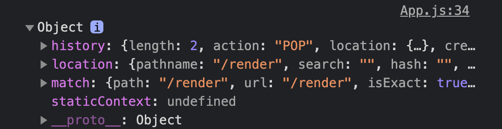
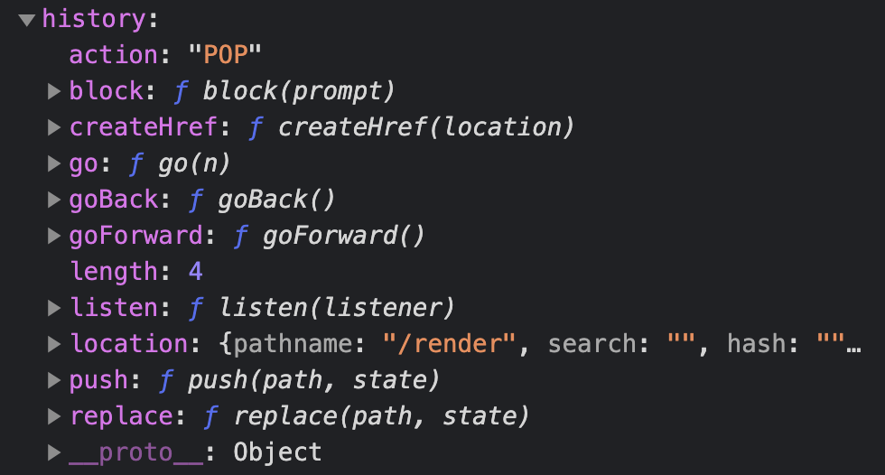
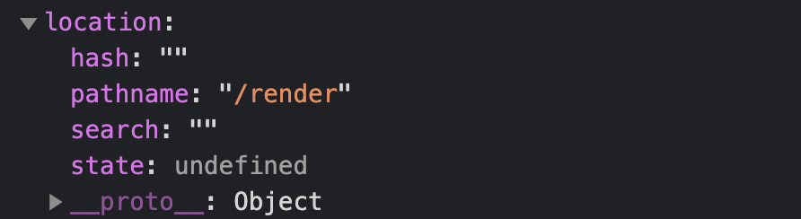
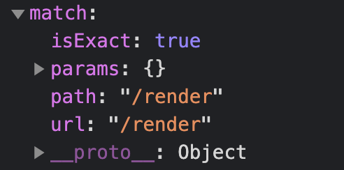
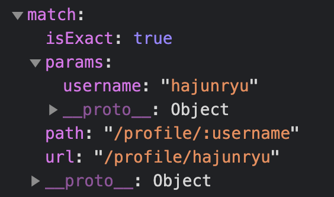
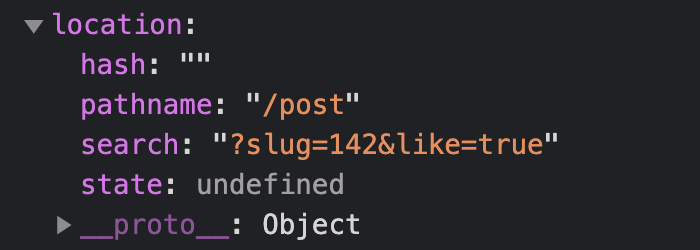
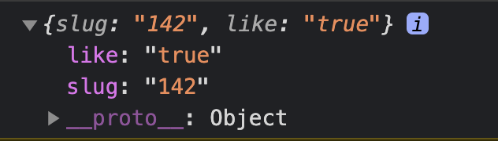

# Router
라우터(router)의 라우트(route)는 길(주소)이라는 뜻으로 네트워크상에서 어떠한 특정 목적지로 가는 길(주소)을 의미한다. 이러한 라우트를 찾아 내는 역할이 라우터이다. react에서는 SPA(Single Page Application)을 만들기 위해 react-router를 사용한다.

## SPA (Single Page Application)
SPA는 전통적인 MPA(Multi Page Application)와 다른 목적으로 만들어진다. 일단 SPA는 이름에서 알 수 있듯이 하나의 html페이지에서 JavaScript코드를 이용하여 여러가지 페이지 및 컨테이너들, 컴포넌트들을 동적으로 그려주게 된다. 그렇기 때문에 기존의 MPA와는 개발방식에 많은 차이가 있고 장점과 단점, 그리고 MPA와 비교했을때 어려운 부분도 많다.

### SPA의 장점
- 서버에 부담이 적음  
MPA방식은 페이지가 전환될때마다 html태그로 시작하여 html태그로 끝나는 파일을 매번 새로 서버에 요청해야한다. 하지만 SPA는 페이지를 처음 접속했을때 딱 1번 서버에 html파일을 받고 그 내부에 script태그로 존재하는 javascript를 이용하여 페이지를 전환 시켜준다.(강제로 새로고침이나 url을 입력하지 않았을 경우)  
MPA의 경우에는 서비스의 규모가 크고 제공되는 정보가 많아야 할 경우에는 매번 페이지가 바뀔때마다 서버에 요청을 하게 된다면 성능상의 문제가 발생할 수 있고 이는 좋지 않은 사용자경험으로 이어지게 될 것이다.

- 향상된 사용자 경험
위에서 얘기했듯이 MPA는 페이지가 전환될때마다 새로운 페이지를 받아올것이고 페이지가 깜빡이며 전환될것이다. 만약 페이지가 전환될때 애니메이션을 넣어주고 싶어도 근본적으로 불가능한 일이라는것이다. 하지만 SPA는 어차피 하나의 페이지에서 View에 뿌려줄 코드들을 가변적으로 교체해주는 방식이고 당연히 원하다면 특정 페이지로 넘어갈때 애니메이션처리도 가능할 것이다. 물론 애니메이션 처리를 하지 않는다고 하더라도 깜빡임 없이 MPA보다 빠른 페이지 전환이 가능하다.

### SPA의 단점
- JavaScript파일의 리소스 양이 많아짐
SPA는 앱의 규모가 커지면 JavaScript파일의 크기는 당연하게 증가한다. 처음 페이지를 로딩할때 실제로 사용자가 방문하지 않을 수도 있는 페이지의 리소스도 한번에 불러와 가지고있기 때문이다. 이 방법은 코드 스플리팅을 사용하면 라우트별로 파일들을 관리 할 수 있다고 하니 그때 다시 알아보자.

- SEO
아마 SPA의 가장 큰 취약점 일 것 같다. SPA는 처음 빈 html파일을 받아올것이고 그렇게 되면 브라우저의 검색 엔진이 빈 페이지로 인식해 사용자들의 검색결과에 페이지가 나타나지 않을 수 있다는것이다. 구글 브라우저는 JavaScript코드를 실행하여 검색엔진이 작동하여 괜찮다고 하지만 이것도 많은 이슈가 있는걸로 알고있다. 만약 구글에서는 잘 검색이 되고 구글이 점유율이 아무리 높다고해도 firefox, safari등의 사용자들을 고려했을때 취약점인것은 맞다. 물론 그래서 Next.js를 사용해 SPA를 SSR(Server Side Rendering)하는 방법으로 해결할 수 있다.

## 자주 사용하는 react router 컴포넌트

- <BrowserRouter> 또는 <HashRouter> : 라우터(Router) 컴포넌트
- <Route>, <Switch> : 라우트 경로(Route Path) 매처(matcher) 컴포넌트
- <Link>, <NavLink>, <Redirect> : 라우트를 변경하는 내비게이션(Navigation) 컴포넌트


### react-router
리액트 라우팅 라이브러리는 react-router, reach-router, Next.js등 여러가지가 있다. 그 중 역사가 가장 길고 사용 빈도가 가장 높은 react-router를 사용해보자.  

react-router는 클라이언트 사이드에서 이루어지는 라우팅을 정말 아주 간단하게 사용할 수 있게끔 여러가지 파워풀한 기능을 제공한다. (SSR을 할 때도 라우팅을 도와주는 컴포넌트들도 존재함)

#### react-router 설치
npm이나 yarn을 이용하여 react-router를 리액트 프로젝트에 설치하자.  

```sh
npm i react-router-dom
# yarn add react-router-dom
```  

#### router 컴포넌트
웹 환경에서는 react router가 제공하는 router 모듈은 두 가지를 주로 사용한다.

- `<BrowserRouter />`  
HTML5 History API를 사용하여 URL과 UI를 매칭한다. (`/home`)  

- `<HashRouter />`  
URL 해시(#)를 사용하여 URL과 UI를 매칭한다. (`/#/home`)  

두 가지 모듈은 각자 다른 props를 전달받고 장단점이 존재하지만 SEO관점에서도 그렇고 history API를 지원하는 BrowserRouter를 기준으로 알아보고 두 모듈의 비교는 다음에 한번 제대로 알아보자.  

그리고 웹 환경 이외에서는 아래의 라우터 컴포넌트를 사용한다
- `<MemoryRouter />`  
URL History를 메모리에 유지(주소 표시 줄이 변경되지 않음)한다. 네이티브 앱(React Native) 환경에서 사용한다.  

- `<NativeRouter />`  
OS, Android 앱과 같은 네이티브 앱(React Native) 환경에서 사용한다.  

- `<StaticRouter />`  
서버 사이드 렌더링 시나리오에 사용되며 URL이 변경되지 않는다. 그래서 정적(static) 라우터이다.  

#### 사용법

##### import
라우터를 사용할 JavaScript파일에서 react-router를 import해준다.  

간단하게 사용하기 위해 BrowserRouter를 불러오고 Router라는 별칭으로 사용해준다.  

```javascript
import { BrowserRouter as Router } from 'react-router-dom'
```

##### 라우터 설정
보통 App컴포넌트에 각각의 페이지 컴포넌트들을 뿌려주기 때문에 App컴포넌트에 Router컴포넌트를 추가하거나 App을 import하여 render해주는 index파일에서 Router 컴포넌트를 추가해준다.  

- App.js
```javascript
const App = () => (
  <Router>
    {/* 내비게이션: <Link>, <NavLink> 사용 */}
    {/* 라우트: <Swtich>, <Router>, <Redirect> 사용 */}
  </Router>
)
```  

또는  

- index.js
```javascript
ReactDOM.render(<Router><App/></Router>, document.getElementById('root'));
```


### Route 컴포넌트
Route컴포넌트는 설정된 path와 매칭되는 컴포넌트를 찾아 일부 UI를 렌더링 한다. path속성의 값으로 route를 지정해주고 해당 route에 맞는 컴포넌트를 렌더링해준다. 렌더링의 방법은 3가지가 있다.

- component속성  
Route의 component속성에 렌더링 할 컴포넌트를 지정해준다.  
```javascript
<BrowserRouter>
  <Route path="/" component={Home} />
</BrowserRouter>
```  

- render 함수
인라인 렌더링 또는 래핑 렌더링 시에 사용한다. Route의 render속성에 전달한 함수가 반환한 리액트 요소를 렌더링해준다.  
```javascript
<Route path="/" render={() => <div className="Home">홈</div>} />
```  

- children
Route컴포넌트의 children요소로 컴포넌트를 넣어주거나 리액트 요소를 반환하는 함수를 넣어 줄 수 있다.  
```javascript
<Route path="/">
  <Home />
</Route>

<Route path="/profile" children={() => (
  <div>profile page</div>
  );
/>
```

이렇게 Route에 의해 렌더링 된 컴포넌트는 모두 동일한 4가지의 props를 전달 받는다.
1. match
2. location
3. history
4. staticContext

이중 staticContext는 Context API에 관한 내용이니 나머지에 3가지에 대해 알아보자.

컴포넌트가 렌더링 된다는것은 결국 함수가 호출된다는 것이다. 그렇기 때문에 하나의 페이지에서 확인 할 수 있는 render속성에 인라인으로 렌더링하는 코드로 알아보자.
```javascript
<Route path="/render" render={props => {
  console.log(props);
}} />
```  
이렇게 console.log를 찍어보면 아래와 같이 4개의 값이 전달되는걸 볼 수 있다.  
  

log에 찍힌 3개 객체의 프로퍼티들은 다음과 같다.

1. history  


2. location


3. match


#### 하나의 Route에 여러 개의 path 설정
하나의 Route에 여러 개의 path를 지정하는 것은 리액트 라우터 5버전부터 적용된 기능이다. 이전 버전에서는 여러 개의 path에 같은 컴포넌트를 보여 주고 싶다면 Route를 여러개 만들며 path는 동일하게, component 속성만 다르게 주는식으로 사용했었다.  
```javascript
 <Route path="/about" component={About} />
<Route path="/info" component={About} />
```

하지만 지금은 path속성의 값으로 배열을 넣어주면 하나의 Router로 여러개의 path를 지정해 줄 수 있다.  
```javascript
<Route path={["/about", "/info"]} component={About} />
```

#### URL 파라미터와 쿼리
페이지 주소를 정의할 때 가끔은 동적인 값을 전달 해야하는 경우도 있다. 크게 파라미터와 쿼리로 나눌 수 있다.  


동적인 값을 전달해야 하는 상황에서 두가지 중 고민할때 무조건 따라야 하는 규칙은 없다. 하지만 일반적으로 파라미터는 특정 아이디 혹은 이름을 사용하여 조회할 때 사용하고, 쿼리는 어떤 키워드를 검색하거나 페이지에 필요한 옵션을 전달할 때 사용한다.

##### URL 파라미터
URL 파라미터 방식은 아래와 같은 방법으로 라우트의 path를 정의하고 사용할 수 있다.
```javascript
<Route path="/profile/:username" component={Profile} />
```

혹은 `?`를 사용하여 선택적으로 사용될 수 있는 파라미터를 등록할 수 있다. 아래와 같이 `?`를 파라미터 뒤에 붙혀주면 해당 파라미터는 필수가 아닌 선택사항이 된다.
```javascript
<Route 
  path="/profile/:username/:isFollow?" 
  component={Profile} 
/>
```

URL 파라미터 요청 예시 : /profile/hajunryu
URL 선택적 파라미터 요청 예시 : /profile/hajunryu/true

위와 같이 요청하게 되면 위에서 살펴 본 컴포넌트의 props에 전달되는 match객체의 params에 해당 값이 전달이 된다. 파라미터값을 username이라고 지정했으니 컴포넌트 내부에서는 props.match.params.username으로 조회하게 되면 해당값이 나오게 된다.



##### URL 쿼리
URL 쿼리 방식은 일반적인 path를 설정하는것과 똑같이 정의해주면 된다. 사용법은 url을 요청할때 query string을 작성해주는 방식이다.

일단 post라는 path를 가진 route를 만들고 요청을 해보자.
```javascript
<Route path='/post/' render={props => {
    console.log(props);
  }}
/>
```

- URL 쿼리 요청 예시 : /post?slug=142

위와 같이 요청했다면 Route에 해당하는 컴포넌트의 props의 location객체의 search프로퍼티의 값으로 query string값이 넘어온다. query string의 값은 이렇게 하나가 아닌 &를 이용하여 여러개를 넘겨줄 수 도 있는데 이때 작성한 쿼리가 만약 `slug=142&like=true`이라고 하면 저 값이 아래와 같이  그대로 문자열로 넘어오게 된다.  

  

이 값을 그냥 쓰려면 개발자가 일일히 각각의 쿼리마다 구분을 해줘야 할텐데 이것을 객체로 바꾸어 각각의 쿼리별로 프로퍼티를 나누어 쉽게 사용할 수 있게 해주는 query-string(qs)패키지가 있다. 설치 후 사용해보자.

```sh
npm i qs

또는

yarn add qs
```

설치 후 사용하려는 컴포넌트 상단에서 import해주자.

```javascript
import qs from ‘qs‘;
```

import를 했다면 qs객체 내부에 parse라는 메서드를 사용하여 첫번째 인자값으로는 location객체 내부의 search프로퍼티의 값(query string값)을 넣어주고 두번째 인자값으로는 parsing option에 대한 정보를 객체로 담아 넣어준다.  

```javascript
<Route
  path='/post/'
  render={({ location: { search } }) => {
    const querys = qs.parse(search, {
      ignoreQueryPrefix: true
    });
    console.log(querys);
  }}
/>
```

그렇게 되면 이제 qs.parse메서드가 내부 로직에서 search의 값을 해석하여 객체 내부에 각각의 쿼리별로 프로퍼티 키와 값을 만들어 그 객체를 반환한다.



하지만 주의해야할 점은 url의 쿼리를 boolean값이나 number(int)값을 줬다고해도 무조건적으로 문자열로 전달되고 qs.parse메서드도 문자열로 만들어 반환한다. 그렇기 때문에 저 값을 사용하여 비교를 할떄는 타입변환을 하여 사용하거나 정확히 같은 문자열과 비교해줘야 한다.

#### 서브 라우트
서브 라우트는 라우트 내부에 또 라우트를 정의하는 것을 의미한다. 코드로 따져본다면 말 그대로 라우트로 사용되고 있는 컴포넌트의 내부에 Route컴포넌트를 또 사용해주면 된다.  
