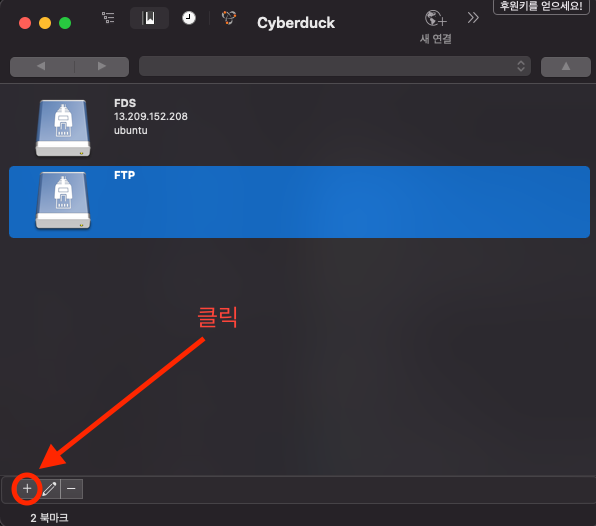
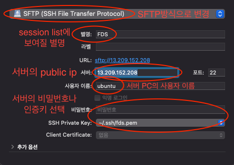
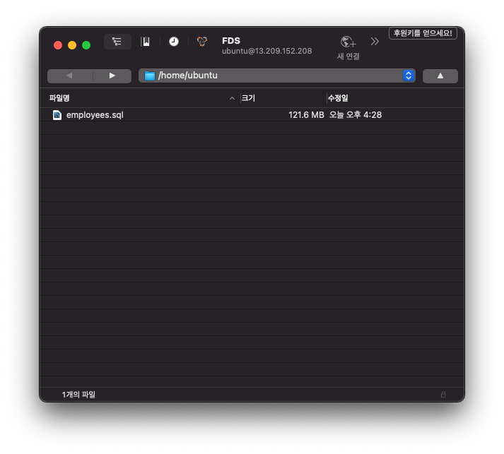

# 화요일

## 오늘 한 일과 느낀점
- **오전 10시 ~ 오후 1시까지 리액트 현강**
    - 오늘 내용은 CRA(Create React App)을 이용해서 빠르게 프로젝트의 구조를 만들고 내부에 어떤 패키지들이 설치가 되어있는지 살펴보았다.  

    - npm을 이용한 개발서버시작, 정적 파일로 번들링, 디버깅을 하는 테스트, CRA내부의 설정을 사용자 정의를 할 수 있게 해주는 eject등을 간략히 한번씩 다뤄보았다.  
    그리고 CRA를 사용할때 브라우저 호환성을 고려하기 위해 react-app-polyfill을 설치하고 가장 낮은 버전을 지원한다고 해도 한계가 IE9이라는것도 알았다.
그리고 어떤 성질의 파일들이 각각 어떤 폴더 구조로 나뉘어져야 하는지, 이유를 설명해주시며 직접 프로젝트 구조를 바꿔보았다.  

    - CSS에 관련한 내용도 있었는데 일단 webpack의 style-loader가 어떤 방식으로 HTML에 스타일을 넣어주는지 살펴봤더니 HTML안에 진짜 inline style을 작성하는것처럼 head태그의 가장 마지막 자식으로 `<style></style>` 태그를 넣어주는것을 알 수 있었다.

    - JSX를 왜 쓰는지도 React.createElement를 직접 중첩으로 사용해보면서 코드의 가독성과 생산성 모두 떨어지는것을 온몸으로 짜증나는것을 느끼며 깨달았던것 같다.

- **오후 2시 ~ 오후 5시 데이터베이스**
    - DDL(데이터 정의어)에 대한 쿼리를 주로 연습했다.
    데이터베이스, 테이블을 만들고 수정, 삭제하는 쿼리, 그리고 문자열 인코딩 방식을 변경해준다던지 테이블에 컬럼을 추가, 수정, 삭제한다던지 하는것들이 모두 DDL이라고 한다.

    - 두 개 이상의 테이블의 정보를 하나의 row query에서 조회 할 수 있게끔 해주는 JOIN과 Sub Query에 대해 간략하게 배웠다. 그리고 JOIN은 INNER JOIN, LEFT JOIN, RIGHT JOIN, OUTER조인이 있는데 이 중에서 OUTER JOIN은 테이블이 결합 JOIN된 상태에서 중복된 값을 제거해주는 union을 사용해야만 원하는 값을 얻을 수 있었다.

    - 데브옵스에 대해 물어봤는데 그냥 단순하게 강사님이 생각하시는 데브옵스 지식을 터득하는 난이도가 프론트엔드의 기술과 비교했을때 어떠시냐고 질문했다.  
    강사님 의견은 그렇게 어렵게 생각하지 않아도 된다 였고 오히려 요즘 시스템 엔지니어의 공급이 적은 상태라 취업이나 연봉협상에서는 유리할 수 있다고 한다. 그냥 막연하게 서비스를 배포하고 그것을 컨트롤하는것에 관심이 있어 도커를 배워보고 싶어서 시간이 나면 한번 접근해봐야겠다.
    (도커, AWS, 쿠버네티스 알아보기)

- **오후 8시 30분 2번째 모의면접**  
    오늘 저번 1차 모의면접에 이어 2차 모의면접이 진행됐다.  
    지금은 사실 1차를 진행할때보다 훨씬 시간적 여유가 없는것 같고 면접에 대한 준비를 거의 못했다.  
    그래서 사실 질문에 대한 대답을 뭔가 명쾌하게 하지 못하고 얼버무린것도 많았던것 같다.  
    그래도 다른것들은 조금 말만 다듬으면 괜찮은데 지금 부족한것은 일하고 싶은 산업군에 대한 관심도와 이해도인것 같다.  
    다음이 마지막 모의면접 아니면 마지막 전 모의면접인데 다음엔 그래도 이번 면접을 기반으로 준비를 좀 하고 임해봐야 할 것 같다.  
    그리고 조금 추상적으로 생각하던 학점은행제나 사이버대학을 통한 학사를 따는것을 좀 더 구체화 시켜봐도 괜찮을것 같다는 의견도 받았다.

## 내일 할 일
- 오늘 읽고 정리중이던 이벤트 핸들링 정리 마치기
- ref에 대해 공부하고 해당 내용을 md파일 형식으로 정리하여 블로그에 포스팅하기

## 데이터베이스 특강 메모

### CLI에서 scp명령어로 서버에 파일 전송하기
scp로 ~/.ssh/fds.pem ubuntu@[public-ip] 서버에 ~/Downloads/employees.sql 파일을 ~/ 경로에 넣어달라는 명령어  
```sh
scp -i ~/.ssh/fds.pem ~/Downloads/employees.sql ubuntu@[public-ip]:~/
```

### cyberDuck GUI로 서버에 파일 전송하기
1. [cyberDuck 다운로드 페이지](https://cyberduck.io/download/)에서 OS에 맞는 프로그램 다운로드 후 압축해제 및 설치

2. 프로그램 실행 후 좌측 하단의 + 버튼을 눌러 session추가


3. session 옵션 설정


4. 만들어진 session을 더블 클릭하여 접속
만들어진 session을 더블 클릭하여 들어가면 아래와 같은 화면이 나오게 되고 클라이언트에서 파일을 드래그 & 드롭하여 cli 명령어로 보내던 파일을 보다 쉽게 처리할 수 있다.


### shell 명령어
대괄호`[]`는 그안에 값을 쓰고 대괄호는 빼고 사용해줘야한다.

#### 리눅스(서버) 명령어
- mysql 접속
`mysql -u root -p`  명령어 입력 후 password 입력

- 로컬의 sql파일을 mysql로 읽기 (데이터베이스 생성 및 내용 추가)  
`mysql -u root -p[password] [데이터베이스 이름] < [sql파일 이름.확장자]`

- mysql서버 종료  
`sudo systemctl stop mysql`

- mysql서버 시작  
`sudo systemctl start mysql`

- 현재 메모리의 상태를 표시  
`free -h`

- 디스크 공간 정보를 표시
`df -h`

- 파일의 내용을 원하는 라인만큼만 출력
`head -n [숫자값] employees.sql`

예) 6번 라인의 끝에서 2라인만큼 출력해달라, 즉 5~6번라인을 출력해달라
`head -n 6 employees.sql | tail -n 2 employees.sql`