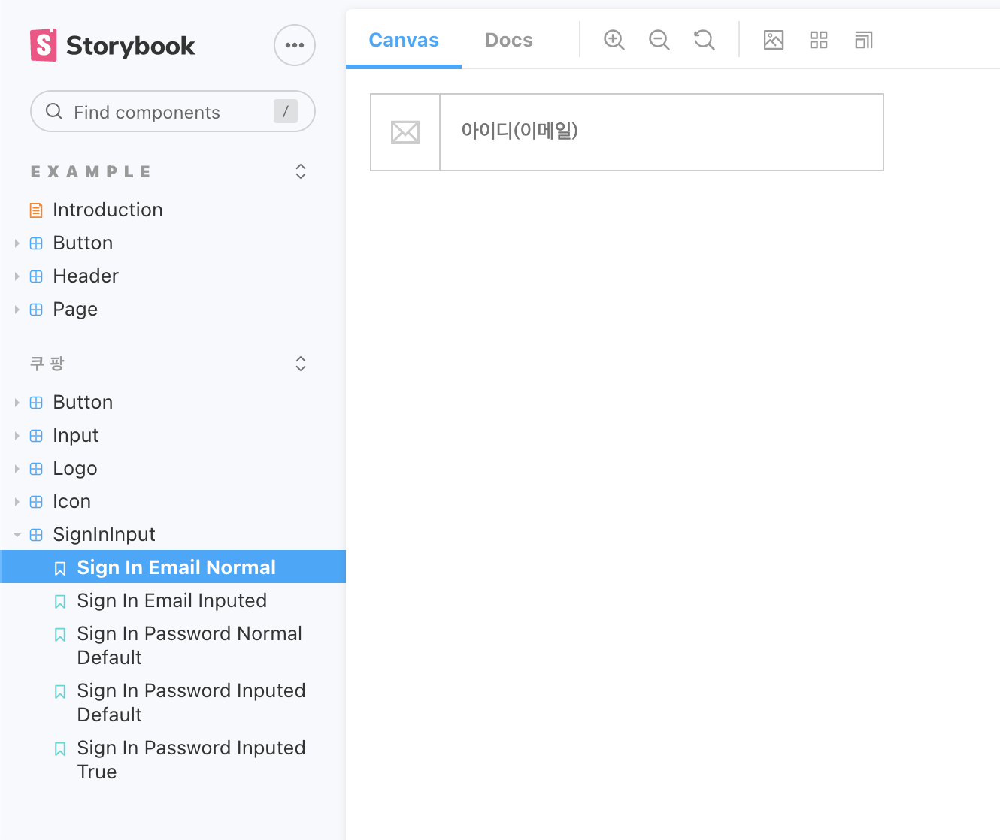

# 2021년 03월 11일 목요일 TIL (CDD, StoryBook, type검사)

## 오늘 한 일과 느낀점
- 오전 10시 ~ 오후 5시 리액트 현강
이번주 목, 금은 하루에 리액트 강의 시간이 점심시간 제외하고 6시간이나 된다.  
오전 시간은 어제 얘기하던 컴포넌트의 추가적인 개념으로 defaultProps와 propTypes에 대해 알려주셨다.  

- 추가적으로 자바스크립트의 typeof가 배열과 객체, null을 구분하지 못하는것을 어떻게 해결하는지 배웠다.

```javascript
// 데이터 타입 검사 유틸리티 함수
function validType(dataType, typeString) {
  return Object.prototype.toString.call(dataType).slice(8,-1).toLowerCase() === typeString
}

function calcTriangleCirc(x, y, z) {
  // 데이터 타입 검사
  if ( 
    !validType(x, 'number') || 
    !validType(y, 'number') || 
    !validType(z, 'number') 
  ) {
    throw new Error('전달되는 인자의 유형은 오직 숫자(number)여야 합니다.')
  }
  return x + y + z
}

// 전달 인자의 유형이 잘못된 경우, 오류 출력!
// 'Uncaught Error: 전달되는 인자의 유형은 오직 숫자(number)여야 합니다.'
calcTriangleCirc('10', '5', '8')
```

- StoryBook을 이용한 CDD(Component Driven Development)
수업을 진행하며 안정적으로 개발하기 위한 방법론인 TDD(Test Driven Development)방식과 CDD방식을 얘기하셨고 저번 수업때 TDD 방식에 대해 간략하게 예제를 통해 체험해봤다.  
그리고 오늘 CDD 방식을 활용하는 StoryBook을 직접 써보며 코딩하는 시간을 가졌다.  
정확하게 StoryBook이 뭐다 라고 아직 정의하기 힘들지만 디자인 시안에서 컴포넌트별로 디자인이 존재하는것 처럼 컴포넌트들을 실제 코드로 작성해서 StoryBook이라는 서비스에서 디자인 시안처럼 볼 수 있게끔 만들어주어 컴포넌트의 무결성을 검증시켜주는것 같았다.  
그래서 그렇게 StoryBook에서 눈으로 보이게끔 만들어진 컴포넌트를 실제 개발환경에서 안정적으로 사용할 수 있게 해주는것이 StoryBook의 역할이라고 생각된다.


## 내일 할 일
- 강의에서 어떤 내용이 나올지 모르니 지금 내일의 계획을 짜는게 의미가 없어지는 경우가 많아지는 것 같다.  
일단 우선순위는 강의의 흐름과 맞추되, 시간이 된다면 꼭 ref읽어보기
