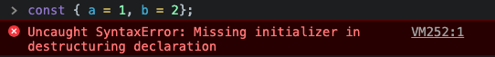

# 2021년 03월 23일 화요일 TIL (구조 분해 할당 기본값 설정)

## 오늘 한 일과 느낀점
- 오전 10시 ~ 오후 1시 리액트 강의  
일단 강의의 시작과 함께 어제 강사님도 정확히 몰랐고 수강생들도 모두 궁금해하던 구조 분해 할당에서의 기본 값 설정에 대해 설명해주셨다. 어제 이해가 되지 않았던 예제 코드는 아래와 같은데
```javascript
function foo(a, b, { serialize = JSON.parse } = {}) {
    console.log(serialize)
}
```
왜 대체 객체 안에서 `:`(콜론)이 아닌 `=`(이퀄)을 사용하여 값을 초기화 하느냐 라는 의문이 들었다는것이다.

근데 저 문법이 지금 함수의 파라미터를 지정하는 곳에서 사용되서 그렇지 사실은 어느곳에서나 쓸 수 있는 객체 분해에 대한 기본값을 지정하는 문법이었다.

객체에 기본값을 할당하고 구조 분해 할당을 할때는 원래 아래와 같이 사용한다.
```javascript
const bar = {
  a: 1,
  b: 2
}

// 1과 2가 각각 a와 b라는 식별자(변수)에 담긴다.
const {a, b} = bar;
```

하지만 객체 분해 할당 문법을 이용하여 위와 같은 코드를 작성한다면 그냥 초깃값을 정해줄 수 있다는것이다. (bar라는 식별자를 다른곳에서도 사용해야하는 경우는 제외)
```javascript
const { a = 1, b = 2} = {};
```

뒤에 왜 대체 객체 리터럴을 할당해줘야 하는가가 헷갈린다면 브라우저에서 직접 코드를 작성해보면 된다.
```javascript
const { a = 1, b = 2};
```



그럼 위와 같이 구조 분해 할당을 하며 초기화를 하는 부분인데 초기화를 해주지 않았다고 문법 에러(syntax Error)를 console창에 띄워주었다. 그냥 단순히 문법적으로 맞지 않는 코드를 작성한것이다.

그럼 처음 예제로 돌아가 얘기하게 되면 객체 분해 할당을 초기값과 같이 사용한다면 좋은점은 사용자(개발자)가 함수를 사용할때 serialize는 값은 함수 내에서 무조건 사용할 수 있고 함수를 호출할때 인자값으로 객체를, 그 객체의 프로퍼티들은 굳이 순서에 상관없이 받아 줄 파라미터와 이름만 맞춰주면 된다.

```javascript
const { a = 1, b = 2, c } = { c : 3 };
function foo(a, b, { serialize = JSON.parse, first, second } = {}) {
  // a와 b는 굳이 이 예제에서 확인 할 필요는 없을 것 같다.
  console.log(serialize, first, second)
  // ƒ parse() { [native code] } "first" "second"
}

foo(1, 2, {second: 'second', first: 'first'});
```
이렇게 foo를 호출할때 전달한 세번째 인자값인 객체내에서는 순서에 상관없이 프로퍼티들을 정의하여 넘겨주었지만 순서에 의미가 있지 않은 객체의 특성상 함수 내부에서 프로퍼티 키를 보고 정상적으로 값을 읽어들였다.  

사실 그냥 함수의 파라미터 갯수를 늘리고 그 순서를 모두 기억하고 사용할 것이라면 위와 같은 행위를 할 필요가 없겠지만 복잡성이 더 올라갈것이라고 생각되고 함수의 파라미터 내에서 사용되는것이 아니더라도 const 변수 2개 이상을 한줄에 선언과 초기화를 해주고 싶을때 사용해도 유용할 것 같다.  


그리고 어제 만들었던 useLocalStorage를 활용하여 틱택톡 게임을 만드는 예제를 진행하며 커스텀 훅으로 컴포넌트 내에서는 조금의 코드만 사용하여 로컬스토리지에 값을 저장하고 불러오는 작업을 실습해봤다.

- 오후 2시 ~ 오후 10시  
내일 수업예정이 있다고 하길래 styled components와 reactRouter, contextAPI에 관한 내용을 예습의 개념으로 간략하게나마 읽어봤다.

## 내일 할 일
- 요즘은 수업이 끝나고 해야하는 공부를 수업이 끝나고 나서야 알 수 있는 경우가 많아서 최대한 수업을 집중하여 듣고 내주는 과제 및 복습, 예습 범위를 잘 지켜가며 공부하기