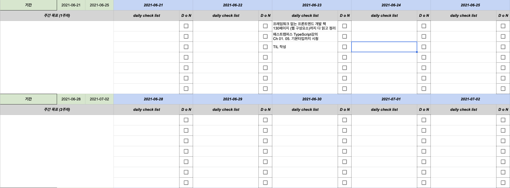
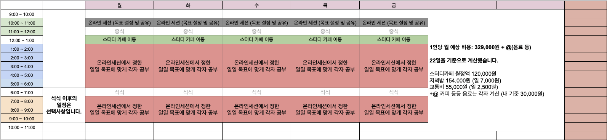

# 2021년 06월 23일 수요일 TIL(공부환경 개선, TypeScript기초, 웹 컴포넌트)

## 오늘 한 일과 느낀점
### 공부환경 개선
집에서 온전히 혼자 독학을 한지 벌써 한달이 넘어간다. Devfolio프로젝트를 진행할때는 온라인으로라도 미팅시간이 정해져있었고 그것이 규칙적인 생활을 지켜주었다. 근데 지금 날이 갈수록 나태해지고 밤낮이 바뀌어 암막커튼을 치고있으면 가끔 낮 시간에 지금이 새벽이라고 착각하고 새벽시간에 낮이라고 착각하는 지경에 이르렀다. 오늘도 오후 3시쯤 잠에서 깻고 깨자마자 기분이 매우 좋지않아 바로 계획을 세웠다. 일단 취업을 하면 규칙적인 생활은 돌아올것인데 그럼 취업전에 내가 채우고싶은 부족한것들에 대해 나열해봤다.

#### 필수
- ***타입스크립트**
- ***Sass(Scss)**
- Redux-saga
- Immer
- Jest, Cypress등 테스트 라이브러리 (TDD방식의 개발)
- 디자인 패턴
- 알고리즘

#### 필요하고 시간이 된다면
- vue.js
- Emotion
- Next.js 등의 SSR 프레임워크
- Jira, Confluence등 협업툴(이건 회사가서 배워도 늦지않을듯)

채용공고를 보며 주관적인 의견으로 작성했고 대략적으로 이런 리스트가 나오게 되었다. 그리고 이젠 하루하루 뭘 하고있는지도 모르고 뭘 해야할지도 방향성이 흐릿해진 지금 목표를 설정하는것이 필요하다고 생각이 됐다. 그래서 아래와 같이 패스트캠퍼스 시절 사용했던 데일리 스크럼 시트를 이용해봤다.

오늘 6월 23일 목표를 적어봤고 현재 시각 23시 44분 일단 지금 작성하고 있는 TIL만 완성하면 3가지 목표를 모두 달성하는셈이다. 오늘은 목표를 많이 널널하게 잡았지만 그래도 없는것보다 훨씬 낫다는 느낌이 든다. 오늘 뭘 해야하는지, 뭘 했는지 한눈에 알아볼수 있기 때문이다.

그리고 웬만하면 스터디를 진행하고 싶다. 집에서 장비는 좋아 편하지만 책상옆에 침대가 있고 그냥 요즘 의지가 약해져서인지 그냥 눕고 싶으면 바로 침대로 다이빙을 한다. 그래서 지금 스터디원을 모집중인데 만약 진행하게 된다면 하게 될 일정표이다. 

### TypeScript 기초
패스트캠퍼스 강의를 들으며 TypeScript를 기초부터 공부해보려고 하고있다. 오늘 첫 인강을 들었고 사실 오늘 내용은 너무 기본적인 ts가 js의 상위 집합이고 tsconfig를 통해 컴파일 옵션을 설정, 어떤 타입이 존재하고 당연히 타입이 맞지 않으면 값이 할당되지 않는다는것, 이런 내용이 전부였다.

### 웹 컴포넌트
올해 2월초 웹 컴포넌트에 관심을 가졌던적이 있다. 하지만 그때는 아무리 봐도 무슨소리인지도 어떻게 쓰는지도 감이 안왔다. 왜냐면 컴포넌트 단위 개발에 대한 개념이 없었기 때문이다. 근데 React를 접하고 웹 컴포넌트를 접하니 마치 React의 클래스형 컴포넌트를 많이 닮은것 같다. 라이프사이클 메서드가 있고 사용자 정의 요소를 만들 수 있다. 물론 아직 직접 프로젝트에 적용해보지 않아서 모르지만 일단 첫 인상은 React보단 복잡도가 높아보인다.

## 내일 할 일
- TypeScript강의 Ch 02 - 05. 제네릭 까지 시청하기
- 프레임워크 없는 프론트엔드 개발 책 HTTP요청 섹션 모두 읽기(155페이지까지)
- parcel을 이용하여 TypeScript를 번들링해보기