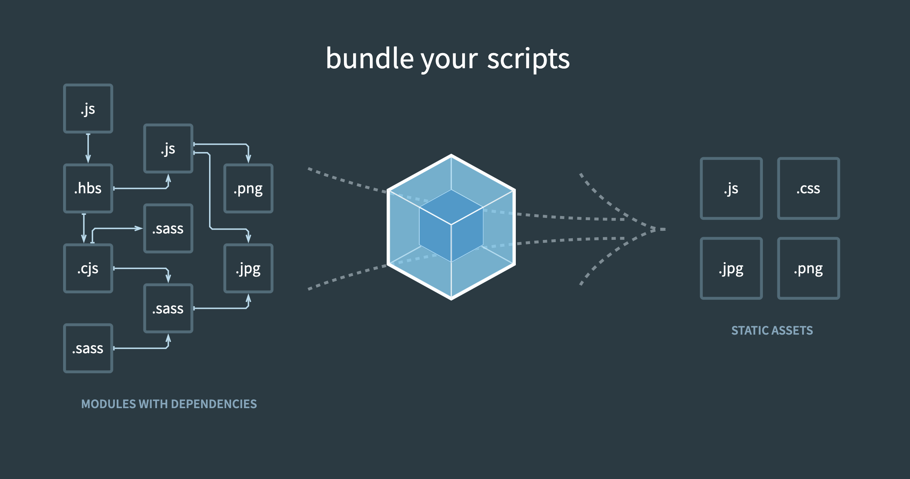
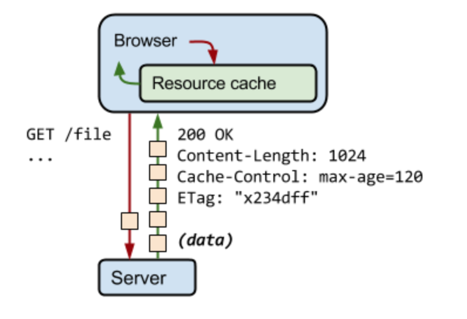

# webpack

## Javascript 모듈의 종류
- Built-in Core Module: 기본적으로 자바스크립트 내부에 탑재된 모듈입니다. 예를 들어 node.js의 path 모듈이 있다.  

- Community-based Module: 보통 npm cli를 통해 설치하는 모듈이다.  

- Local Module: 애플리케이션의 개발자가 직접 정의하는 모듈이다.  

## 모듈을 사용할때의 장점
- 모듈로 정의해놓고 가져다쓸 수 있기때문에 코드의 재사용성이 증가한다.  

- 코드의 관심사가 모듈별로 분리되어 있어 관리, 즉 유지보수가 편해집니다. 그렇기 때문에 코드를 모듈화하는 기준이 명확해야한다.  


## webpack이란?

webpack은 웹 개발을 할때 좀 더 편리하고 강력한 개발환경을 위해 사용하는 모듈, 번들러이다. 아래 사진을 보며 살펴보자. 

이 사진은 webpack의 메인페이지에 표시되는 이미지이다. 이미지 왼쪽을 보면 서로 다른 확장자 또는 같은 확장자를 가진 여러개의 파일들이 의존성 그래프를 이루고 있는것을 볼 수 있다. 이렇게 각각의 파일들을 하나의 모듈단위로 서로 의존성을 가질 수 있게 해주는것이 모듈화이다. 그리고 그 모듈화 된 파일들을 하나의, 혹은 확장자에 따라 알맞은 파일의 갯수로 합쳐주는것이 번들링이다.  
webpack은 이런 모듈화와 번들링 과정에서 다양한 설정을 제공하고 개발자는 프로젝트에 맞는 설정을 커스터마이징 할 수 있다. 설정할 수 있는 요소들이 너무 많아 모든 설정을 정확히 다 아는사람이 없지않을까 생각이 든다...

## 캐싱과 해시
웹 애플리케이션에서의 캐싱이란 HTTP 캐싱을 말한다. 유저가 애플리케이션의 도메인에 접근하면 필요한 파일을 브라우저 -> 웹 서버-> 서버로 요청을 할 것이다. 하지만 매번 도메인에 접근할때마다 변하지 않는 파일을 계속 서버에서 받아오는것은 유저의 입장에서도 매번 a부터 z까지의 파일을 모두 받아야하니 응답받는 시간이 길어져 좋지 않은 사용자경험을 겪을 수 있고 서버의 입장으로는 불필요한 트래픽이 계속 발생하게되는것이다. 그래서 리소스가 바뀌고 도메인에 최초 접근했을때 한번 a부터 z까지 요청을 하고 받아온 데이터를 웹서버에 저장해놓는것이 캐싱이다. 캐싱된 데이터는 서버에서의 리소스가 바뀌지 않는 이상 서버에 접근하는것이 아닌 웹서버에 캐싱되어진 데이터를 유저에게 보여준다. 웹서버는 실제 서버에 비해 클라이언트와 가까이 있기때문에 상대적으로 더 빠른 응답을 받을 수 있는것이다.

<center>이미지 출처 - https://pjh3749.tistory.com/264</center>  

하지만 여기서 이슈가 발생한다. 캐싱은 리소스가 변하지 않는 이상 서버에 새로운 요청을 하지 않는다고 했는데 리소스란 쉽게 파일의 이름이라고 생각하면 된다. 그렇다는건 코드가 업데이트 되었을때 같은 파일의 이름으로 번들링이 되어 배포된다면 유저의 브라우저에서는 이 리소스가 변하지 않았다고 판단하여 계속 예전의 캐싱된 버전의 번들파일이 실행될 것이다. 그래서 번들링을 할때 hash를 사용하여 만약 build시에 파일의 내용을 보고 변경사항이 있다면 새로운 해시값으로 번들파일의 이름을 만들어주는것이다. 이렇게 되면 위의 이슈가 해결이 될 것이다.  

[참고 문서 - HTTP caching mdn](https://developer.mozilla.org/ko/docs/Web/HTTP/Caching)

그래서 webpack에서 다룰 수 있는 해시는 대표적으로 3가지가 있다.
### webpack에서의 3가지 해시 타입
1. hash: 위에서 설명한 build시에 모듈들의 파일 내용을 보고 하나라도 변경사항이 생겼다면 무조건 해시값을 바꿔준다. 그렇기 때문에 만약 js파일만 변경되고 css파일에 변경이 없을때도 두 파일 모두 해시값이 변경된다. 그렇다면 웹 서버 입장에서는 변경이 없는 css파일도 변경이 있다고 판단하여 캐싱된 파일을 지우고 다시 서버에 요청을 하고 응답을 받는 과정을 거치게된다.  

2. contenthash: 위의 이슈를 해결해줄 수 있는 해시 방법이다. content의 변화별로 hash값을 부여해준다. 즉, css파일에 contenthash를 적용해준다면 js파일만 변경되었을때 build시 js파일의 hash값만 변경되고 css의 hash는 변경되지 않아 웹 서버에 혼란을 주지 않을 수 있다.  

3. chunkhash: 캐싱과 해시는 애플리케이션의 최적화에 관한 주제이다. 근데 가만히 생각해보면 js파일이 하나의 chunk파일로 번들링된다면 내부에 변경이 될 값과 변경이 되지 않을 값들이 분명 존재할것이다. 그래서 대표적으로 변경이 되지 않는다고 판단하는 코드는 runtime에 필요한 코드, Community-based Module 즉, 라이브러리, 프레임워크들에 대한 코드이다. 그렇다면 실제로 개발중 변경이 일어날 코드는 말 그대로 개발자가 직접 작성하는 코드들이다. 이 방법에는 정답이 없지만 보통 이렇게 3가지 chunk파일로 나누는것으로 안다. 
  - runtime chunk파일: runtime시에 애플리케이션을 안정적으로 구동시켜줄 코드
  - venders chunk파일: 외부 의존성 모듈들의 코드(라이브러리, 프레임워크)
  - main(bundle) chunk파일: 실제 개발을 하며 자주 변경될 코드

토이 프로젝트에서는 이런 최적화 작업을 벤치마크를 하지 않으면 체감할 수 없겠지만(정말 작은 규모라면 벤치마크를 해봐도 알 수 없지 않을까...) 실제 MAU가 굉장히 높은 서비스 같은 경우는 이것을 꼼꼼히 적용해주고 안해주고에서 엄청난 차이가 날 것이라는 생각이 든다.  

그래서 우아한 형제들에서는 복지 혜택으로 실제 대규모 서비스와 비슷하게 테스트를 할 수 있게끔 AWS에 모든 서비스를 회사가 부담해주고 있다고 하는데 이것 외에도 뭔가 우아한형제들에선 개발자들의 성장에 많이 힘쓰고 있는것같다. (왜 갑자기 배민얘기...)

## style-loader vs mini-css-extract-plugin
webpack은 js파일 이외의 확장자들을 모듈화할때 loader나 기타 plugin을 사용해야 한다. 그 중 css나 sass등의 스타일 코드들을 css-loader, sass-loader로 불러와 번들링하여 index.html에 적용시켜주는 style-loader와 mini-css-extract-plugin이 있다. 처음에는 왜 2가지가 비슷한일을 하고 결과물은 똑같이 나오는데 구분이 되어있는지 몰랐다. 근데 완전히 역할이 달랐다.  

일단 style-loader는 불러온 스타일 코드들을 index.html의 style태그로 삽입해줌으로써 스타일을 적용시켜준다. 반대로 mini-css-extract-plugin은 불러온 스타일 코드들을 하나의 css파일로 합쳐 번들링하여 index.html에서 link태그로 불러오게끔 해준다. 그럼 이것의 차이는 무엇인가? 결론부터 얘기하면 style-loader는 개발환경에서, mini-css-extract-plugin은 배포환경에서 사용된다.  

이유는 간단하다. style-load는 그냥 Javascript에서 DOM에 접근하여 style태그을 삽입하여주는 작업을 해주는것이라 속도가 상대적으로 빠르다. 하지만 mini-css-extract-plugin은 js chunk파일에서 스타일 코드만 분류하여 새로운 파일로 추출해주는것이기 때문에 css코드가 자주 바뀌는 개발환경에서는 비효율적이라는것이다. 그리고 캐싱과 해시에서 살펴봤듯이 새로운 해시값으로 파일을 생성하는 행위 자체가 실제 배포환경에서의 성능 최적화를 위한것이라 개발환경에서는 굳이 필요가 없다. 그래서 개인적인 생각으로는 토이 프로젝트에서는 솔직히 배포를 style-loader로 하더라도 크게 차이가 없을것이라고 생각한다. 물론 그래도 이것을 알고있는것과 모르는것은 큰 차이라고 생각한다!

## webpack.config.js
```javascript
const path = require('path');
const HtmlWebpackPlugin = require('html-webpack-plugin');
const MiniCssExtractPlugin = require('mini-css-extract-plugin');
// 다른 plugin과는 다르게 디스트럭처링 할당으로 불러와야합니다.
const { CleanWebpackPlugin } = require('clean-webpack-plugin');

module.exports = {
  // 의존성을 가진 모듈들의 진입점을 설정
  entry: ['./src/js/index.js'],
  // 모듈들을 번들링 한 번들 파일에 대한 설정
  output: {
    // 번들 파일의 이름 ([hash]를 넣어주게 되면 build시에 파일의 내용이 바뀌었을때 hash값을 바꿔주어 캐시때문에 일어나는 이슈를 해결해줍니다.)
    // [name]에 들어오는값은 entry파일의 이름 또는 webpack config파일에서 name프로퍼티값으로 지정한 값이 들어오게 됩니다.
    filename: '[name].[chunkhash].js',
    // 번들 파일을 만들 경로 __dirname은 이 변수를 쓴 파일의 절대경로를 반환해준다. 그리고 path.resolve함수를 통해 인자들 사이에 / 를 넣어 합쳐줍니다.
    path: path.resolve(__dirname, 'dist')
  },
  // 사용 할 모듈들을 정의
  module: {
    rules: [
      {
        // 어떤 파일들이 loader의 대상이 될지 정규표현식을 통해 작성해줍니다.
        test: /\.css$/i,
        // 사용하는 loader의 key 또는 객체 형식으로 loader key와 options를 설정해줄 수 있습니다.
        use: [
          // {
          //   loader: 'style-loader',
          //   options: {
          //     // 여러개의 css, 또는 sass 파일을 불러올때 html파일에 여러개의 style태그가 생기는것이 아닌 하나의 style태그로 번들링해주는 옵션입니다.
          //     injectType: 'singletonStyleTag'
          //   }
          // },
          // style
          { loader: MiniCssExtractPlugin.loader },
          {
            loader: 'css-loader',
            options: {
              // css를 module처럼 사용하기 위해 클래스 선택자를 해시값으로 만들어주고 그것을 js파일에서 import해서 사용할 수 있다.
              modules: false
            }
          }
        ]
      }
    ]
  },
  plugins: [
    // template으로 지정한 파일로 build시 필요한 script나 link태그의 경로를 삽입하여 index.html파일을 생성해줍니다. 만약 번들파일이 hash값으로 나온다면 이것의 이름에 대해 신경 쓸 필요가 없습니다.
    new HtmlWebpackPlugin({
      template: './index.html'
    }),
    // 캐싱의 문제때문에 생길 수 있는 변수를 방지하거나, hash값으로 번들파일이 나올때 불 필요한 이전 파일은 삭제시켜줍니다.
    new CleanWebpackPlugin(),
    // css는 js와 변경시점이 다르므로 [contenthash]를 사용하여 js가 변경되었을땐 css의 hash값이 변하지 않게끔 contenthash를 사용해줍니다. (기본적으로 MiniCssExtractPlugin을 사용하면 js와 css는 chunk가 다릅니다.)
    new MiniCssExtractPlugin({ filename: '[contenthash].css' })
  ],
  optimization: {
    runtimeChunk: {
      name: 'runtime'
    },
    // chunk파일들을 나누는 기준을 설정합니다.
    splitChunks: {
      cacheGroups: {
        commons: {
          // 이 애플리케이션의 개발자는 node_modules에 존재하는 라이브러리, 프레임워크의 코드들을 수정할 일이 없으니 venders라는 파일명으로 chunk파일을 분리하여 캐싱시켜줍니다.
          test: /[\\/]node_modules[\\/]/,
          name: 'venders',
          chunks: 'all'
        }
      }
    }
  },
  mode: 'none'
};
```