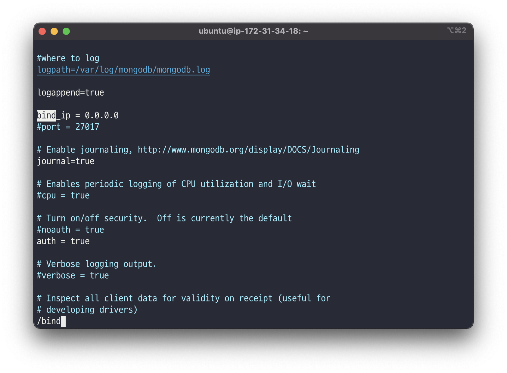
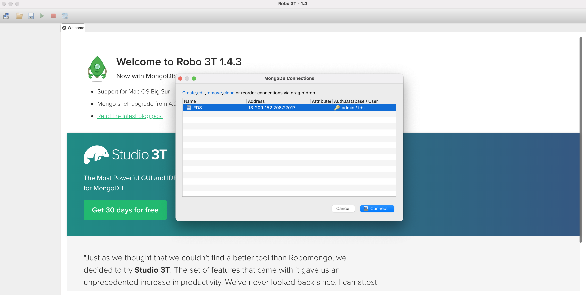
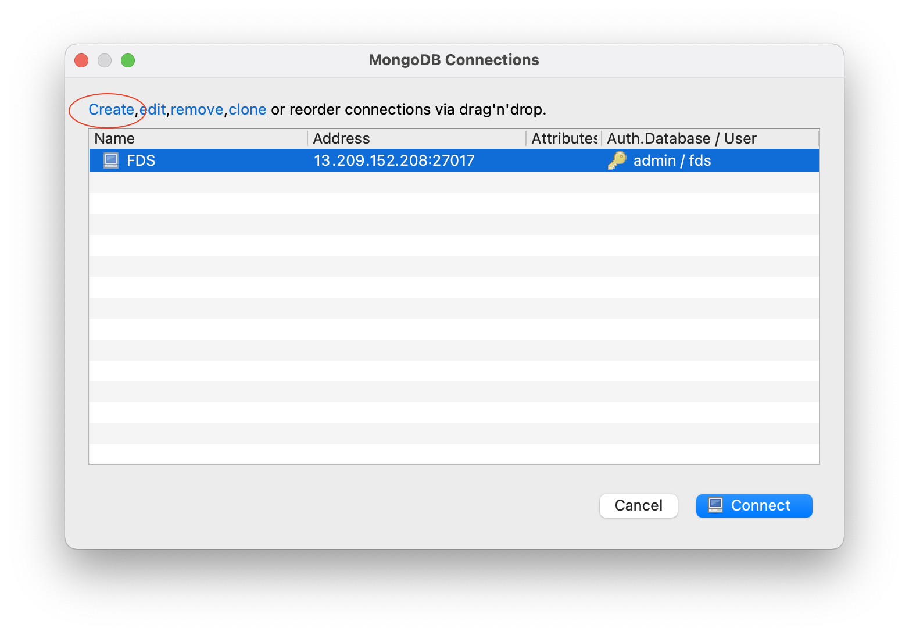
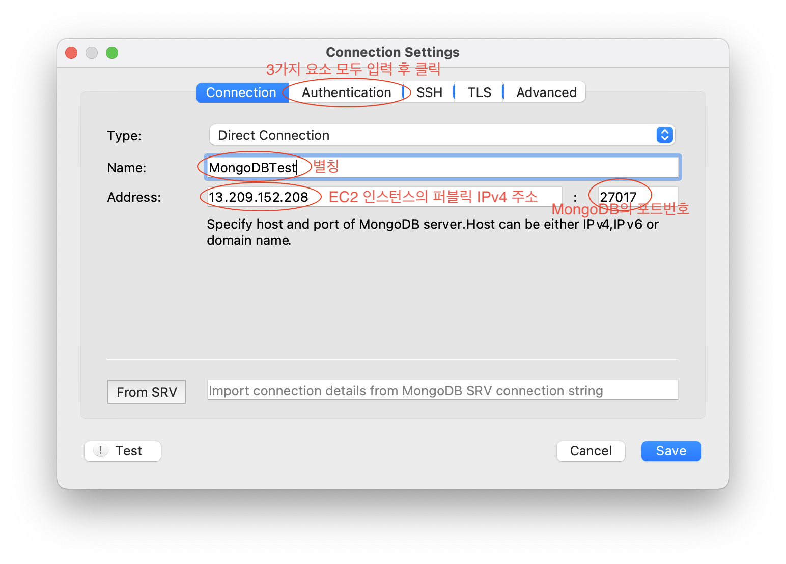
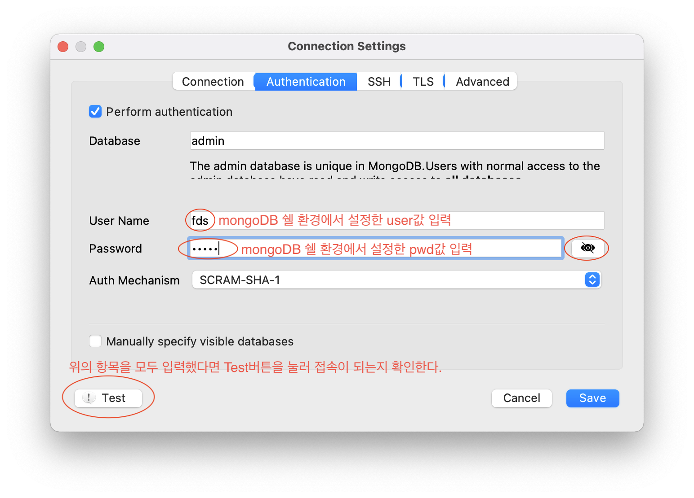
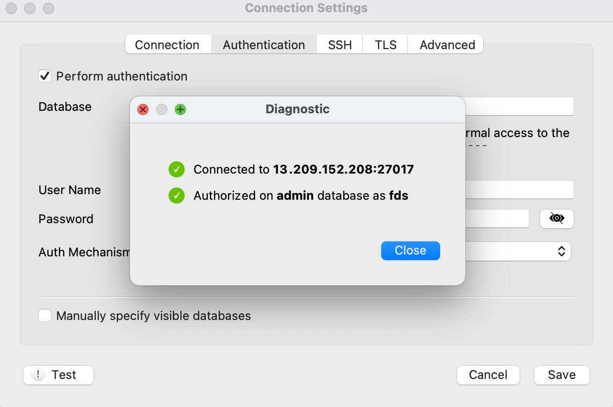
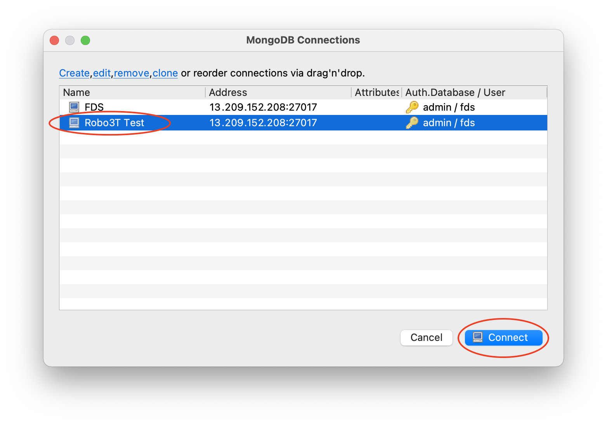
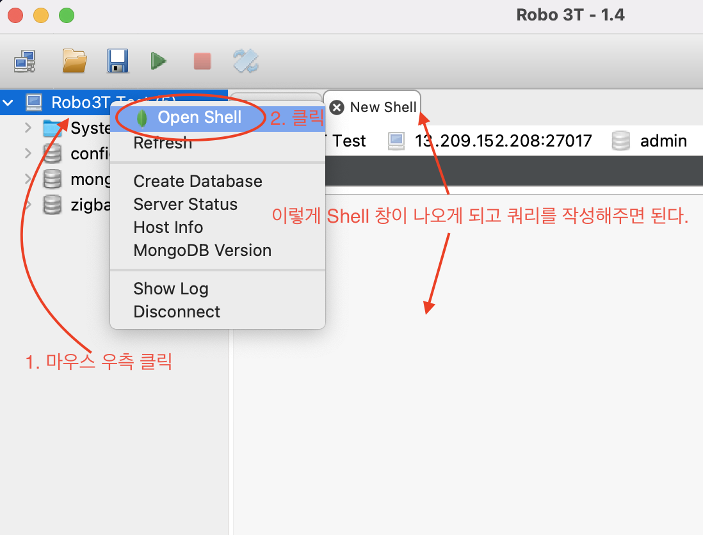

# EC2 인스턴스에 MongoDB 설치

## EC2 인스턴스에 접속
[EC2 인스턴스를 생성](https://dev-junn.netlify.app/#/database/AWS-EC2-%EC%9D%B8%EC%8A%A4%ED%84%B4%EC%8A%A4-%EC%83%9D%EC%84%B1)한다. 기존에 있다면 터미널을 열고 아래 명령어로 EC2 인스턴스에 접속한다.
```sh
# ssh -i [ssh경로] [사용자명]@publicIPv4주소
ssh -i ~/.ssh/fds.pem ubuntu@13.125.00.000
```

## MongoDB설치 및 설정
클라우드PC에 정상적으로 접속했다면 명령어를 통해 mongoDB를 설치해준다.
```sh
sudo apt install -y mongodb
```

설치를 끝내고 vim에디터를 이용해 설정파일을 열어 일부 사항을 수정해준다.
```sh
sudo vi /etc/mongodb.conf
```

설정파일을 연 후 아무것도 하지않고 바로 `/bind`를 입력하여 바꿔야하는 부분을 찾아 준 후 Enter를 눌러준다. 그렇게 되면 커서가 bind라는 키워드에 가게 된다.  


그리고 `i`를 눌러주어 INSERT 모드로 전환 후 위 사진처럼 bind_ip의 값을 0.0.0.0으로 바꿔주어 누구나 접근 할 수 있게끔 설정해준다.

bind_ip항목보다 좀 더 아래에 보면 `# auth = true`라는 코드가 있는데 쉘 스크립트의 주석인 #을 없애주어 인증을 활성화 시킨다. 만약 auth의 값이 주석처리 되어있거나 false라면 별도의 인증없이 IP주소만 안다면 누구나 해당 서버의 MongoDB에 CRUD를 할 수 있게된다.  

위의 설정이 끝났다면 esc를 누룬 후 `:wq`명령어를 통하여 설정파일을 저장하고 vim에디터를 종료한다.  

그 후 `mongo`명령어를 이용하여 mongoDB쉘 환경을 실행시켜주고 아래의 명령어를 입력하여 user의 정보를 만들어 준 후 quit()함수를 이용하여 MongoDB쉘 환경을 종료한다.

```sh
use admin
db.createUser(({ user: 'fds', pwd: 'fdspw', roles: ['root'] }))
quit()
```

이제 설정이 완료됐으니 MongoDB를 재시작하는 작업을 해줘야한다.  
터미널에서 탭을 누르다보면 `sudo systemctl restart mongodb.service`라고 나올 수 있는데 둘 다 똑같은 명령이다.
```sh
sudo systemctl restart mongodb
```

## MongoDB GUI Robo 3T
[Robo 3T 다운로드 페이지](https://robomongo.org/download)에서 Robo 3T를 다운받아준다. Studio 3T는 유료버전이니 Roo 3T를 받아주도록 하자. 다운받을때 이메일과 이름을 요구하는데 작성한 이메일로 인증이 필요하진 않으니 그냥 대충 입력해도 될 것 같다.  
다운이 다 되었으면 실행하여 설치해준다. MAC OS의 경우에는 악성 소프트웨어가 있는지 확인할 수 없어 설치를 못한다고 나올 수 있는데 그럴땐 시스템 환경설정 > 보안 및 개인 정보 보호 메뉴에서 일반탭에 들어가서 하단에 프로그램 설치를 허용해주는 버튼을 누르면 된다.  

처음 실행하면 username이나 부가정보를 적으라는 창이 뜬 것 같은데 그냥 next를 눌러 념겨준다. 그렇게 되면 아래와 같은 창이 나오게 된다. 당연히 처음엔 아래와 다르게 아무것도 없는게 정상이다.


팝업창의 왼쪽 상단에 create버튼을 눌러준다.  
 

Name과 Address항목을 채워준다. Name은 해당 별칭, Address는 EC2 인스턴스의 퍼블릭IPv4 주소를 적어주고 MongoDB의 포트번호는 27017이다. 항목을 모두 다 채워줬다면 상단의 Authentication 탭을 눌러준다.  
  

Authentication탭으로 이동하는 이유는 아까 MongDB설정파일에서 `auth = true`라는 설정을 넣어줬기 때문에 인증이 필수적이기 때문이다. 이동했다면 왼쪽 상단의 Perform authentication 항목을 체크해준다. 그리고 User Name과 Password항목을 mongoDB 쉘 환경에서 설정했던 user와 pwd항목이 값과 동일하게 넣어준다. 위에서는 user의 값은 fds, pwd의 값을 fdspw라고 설정해주었다. 항목을 모두 입력했다면 왼쪽 하단의 Test버튼을 눌러 접속이 잘 되는지 확인해준다.  
  

위의 순서대로 모두 정상적으로 입력이 됐다면 아래와 같은 팝업창이 뜰 것이다.  


이제 우측 하단의 Save버튼을 눌러 저장해준다.  

그렇게 되면 이제 아래와 같은 리스트가 나오게 되고 만들어준 리스트를 더블 클릭하거나 선택 후 우측 하단의 Connect를 누르면 이제 GUI환경에서 MongoDB로의 접근이 가능해진다.  


이제 사이드바에서 마우스 우측클릭 후 New Shell메뉴를 클릭하여 Shell창을 띄운 후 쿼리를 입력해주면 된다!  

