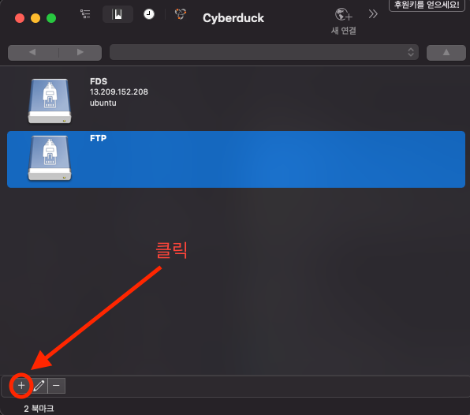
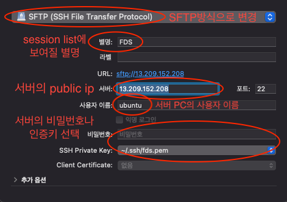
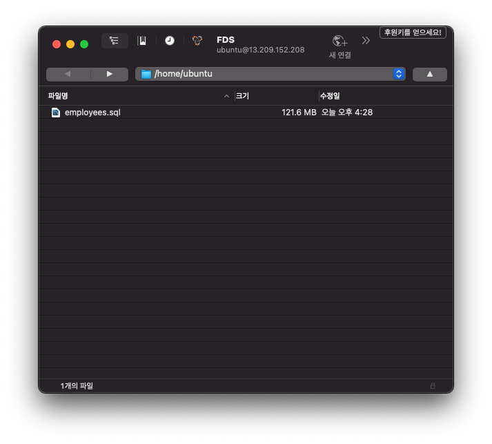

# CyberDuck GUI로 서버에 파일 전송하기

### 1. [CyberDuck 다운로드 페이지](https://cyberduck.io/download/)에서 OS에 맞는 프로그램 다운로드 후 압축해제 및 설치  

### 2. 프로그램 실행 후 좌측 하단의 + 버튼을 눌러 session추가  
  

### 3. session 옵션 설정
  

### 4. 만들어진 session을 더블 클릭하여 접속
만들어진 session을 더블 클릭하여 들어가면 아래와 같은 화면이 나오게 되고 클라이언트에서 파일을 드래그 & 드롭하여 cli 명령어로 보내던 파일을 보다 쉽게 처리할 수 있다.

  
