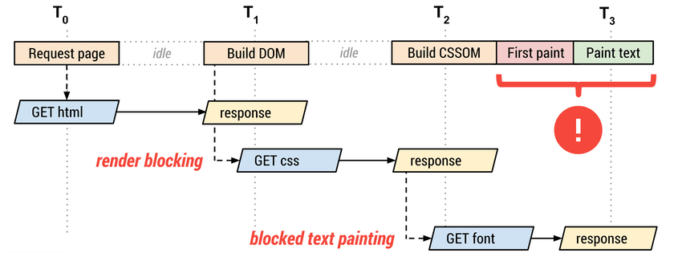
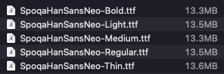
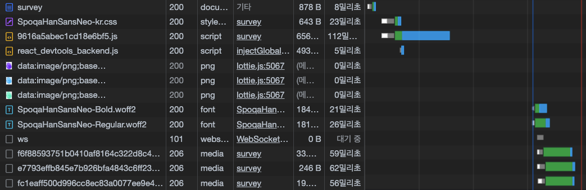
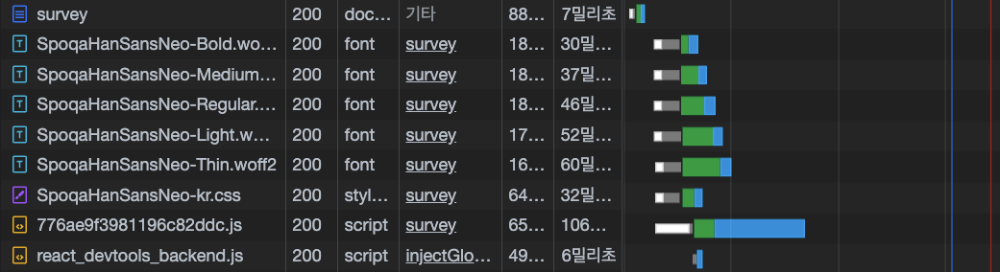

# 웹 폰트

웹이 발전함에 따라 사용자가 웹에서 정보를 얻는 과정의 경험(UX)을 개선하려는 노력이 행해지고 있다. 그런 노력 중 하나인 웹 폰트는 로컬의 폰트 설치 상황에 상관없이 웹에서 항상 원하는 타이포그래피를 사용할 수 있게 하는 기술이다.

## 사용법

웹 폰트는 CSS의 `@font-face` 규칙을 사용해 적용한다.

```css
@font-face {
  font-family: 'Spoqa Han Sans Neo';
  font-weight: 700;
  src: local('Spoqa Han Sans Neo Bold'),
    url('https://cdn.jsdelivr.net/gh/spoqa/spoqa-han-sans@latest/Subset/SpoqaHanSansNeo/SpoqaHanSansNeo-Bold.woff2')
      format('woff2'), url('https://cdn.jsdelivr.net/gh/spoqa/spoqa-han-sans@latest/Subset/SpoqaHanSansNeo/SpoqaHanSansNeo-Bold.woff')
      format('woff'),
    url('https://cdn.jsdelivr.net/gh/spoqa/spoqa-han-sans@latest/Subset/SpoqaHanSansNeo/SpoqaHanSansNeo-Bold.ttf')
      format('truetype');
}
```

또는 위처럼 정의되어 있는 CSS파일을 CDN으로 요청하여 사용하기도 한다.

```html
<link
  href="//spoqa.github.io/spoqa-han-sans/css/SpoqaHanSansNeo.css"
  rel="stylesheet"
  type="text/css"
/>
```

그 후 적용하고 싶은 선택자에 font-family 속성의 값으로 넣어주면 된다. font-family의 값은 적어준 순서에 따라 현재 사용 가능한 폰트를 사용한다. 즉, 웹 폰트는 환경에 따라 사용할 수도 없는 상황이 생기기 때문에 보통 fallback 폰트를 뒤에 적어준다.

```css
body {
  font-family: 'Spoqa Han Sans Neo' 'sans-serif';
}
```

## 웹 폰트의 문제점

웹 폰트를 서비스의 완성도를 위해 사용하지만 웹 폰트는 여러가지 문제점을 가지고 있다. 기본적으로 웹 폰트는 사용자의 로컬환경에 폰트파일이 존재하지 않는 한 요청과 응답에 필요한 시간이 존재한다. 이에 관하여 실제로 겪은 경험과 원인 해결법에 대해 적어보고자 한다.

현재 모바일 앱 내부의 웹뷰로 들어가는 페이지를 개발중에 있고 해당 페이지에서 Spoqa Han Sans Neo 웹 폰트를 사용하고 있다. Spoqa Han Sans Neo는 현재 Spoqa에서 무료로 배포중인 타이포그래피이다. 가장 간단하게는 공식페이지에서 제공하고 있는 CDN 주소를 CSS에서 import하여 적용하는 방법이다. 하지만 spoqa에서 배포해놓은 CDN이 jsdelivr라는 무료 CDN이라 공식페이지에 불러오는 속도가 느릴 수 있다고 나와 있다. 하지만 개발환경인 데스크탑에서는 문제없이 잘 사용이 되는것으로 보였고 해당 이슈는 실제 서비스가 사용되는 모바일 환경에서 아래와 같이 발견이 됐다.


보다싶이 페이지가 렌더링 됐지만 아직 웹 폰트의 로딩이 끝나지 않아 fallback 폰트로 먼저 적용되고 웹 폰트가 로딩이 되니 폰트의 스타일이 바뀌며 텍스트가 번쩍이는 이슈가 발생했다. 이러한 현상을 FOUT(Flash Of Unstyled Text)라고 한다. 말 그대로 웹 폰트가 적용되지 않은 폴백 폰트 상태에서 폰트가 바뀌며 텍스트 번쩍임이 일어나는것이다.

### 문제의 원인

문제의 원인이 무엇일까? 일단 이것을 이해하려면 브라우저의 렌더링 과정에 대해 살펴봐야 한다. 다음은 브라우저가 웹 폰트를 다운로드해 웹 페이지를 렌더링하는 과정이다.

  
<cite>사진 출처 - https://web.dev/optimize-webfont-loading/</cite>

큰 틀로 순서를 정리해본다면 아래와 같다.

1. 페이지 url 접근
2. HTML 요청
3. HTML파일을 응답받아 DOM 트리 생성 및 CSS 요청
4. CSS파일을 응답받아 CSSOM 트리 생성 및 font파일 요청
5. DOM 트리와 CSSOM 트리를 기반으로 Render 트리 생성 및 First paint
6. font파일 응답 및 텍스트 리페인트

4번 과정부터 유심히 살펴보자. CSSOM트리가 생성될때 font-family에 명시되어 있는 웹 폰트는 이제야 요청이 일어나고 있는 단계이고 이에 대한 응답을 기다리는때에 5번과정에서 사용자의 화면에 첫 렌더링이 일어난다. 그리고 웹 폰트의 다운로드가 완료되었을때 font-family가 적용되어 리페인트가 일어나며 텍스트 번쩍임 현상이 일어나는것이다.

## 해결법

해당 이슈는 결국 웹 폰트가 네트워크를 통해 다운로드 하는 자원이라 다운로드 받는 시간이 필요하기 때문에 발생한다. 그렇다면 결국 다운로드 받는 총 시간을 줄여 완화시킬 수 있을것이다.

### 폰트 파일의 용량 줄이기

요청과 응답에 필요한 시간은 보통 응답받는 데이터의 크기에 비례한다. 한글을 표현하는 웹 폰트는 모든 경우를 조합하면 글자 수가 11,172가지나 되기 때문에 용량이 MB단위가 된다. 이것을 자주 쓰이는 글자만 추려 서브셋 폰트라는것을 만들고 모던 브라우저에서는 압축형식을 WOFF2로 사용하여 획기적으로 줄여쓴다. Spoqa Han Sans Neo 같은 경우 서브셋 폰트가 아닌 오리지널은 아래와 같이 각각의 font-weight별로 13MB정도의 크기를 가지고 있다.



하지만 보통 서비스에서 11,172가지의 모든 글자들이 사용되는 일은 없다. 그래서 자주 사용되는 2,350자만을 가지고 서브셋 폰트를 만드는데 spoqa han sans neo같은 경우는 노민지, 윤민구님의 `KS 코드 완성형 한글의 추가 글자 제안` 논문을 바탕으로 추가 글자 224자를 더해 2,574자를 서브셋으로 기본 지원하고 있다. 그리고 크로스 브라우징을 위하여 woff2, woff, ttf등의 여러가지 압축 형식도 지원한다. 즉, 현재의 이슈에서는 서브셋을 직접 만들 필요는 없어 보인다.

만약 폰트의 서브셋을 직접 만들어야 할 경우에는 아래 레퍼런스를 참조하면 좋을것 같다.  
[폰트툴즈의 pyftsubset을 사용한 폰트 서브셋 만들기](https://www.44bits.io/ko/post/optimization_webfont_with_pyftsubnet)

### 좀 더 쾌적한 환경의 CDN에 서브셋 파일 배포하기

spoqa han sans neo에서는 웹 폰트를 제공하는 CDN이 무료 버전이기 때문에 느릴 수도 있어 직접 서브해서 사용하는것을 추천하고있다. 그래서 Spoqa에서 직접 서브셋 파일을 다운로드하여 AWS S3에 올려놓고 서브하여 사용하는 방식으로 바꿔봤다. 그리고 2개의 요청에 대해 브라우저의 개발자 메뉴에서 네트워크 탭을 켜고 요청과 응답에 어느정도의 시간이 걸리는지 비교해봤다. 환경은 테스트에 차이가 있는지 확인하기 위해 캐시 사용을 중지하고 쓰로틀링을 걸어 Fast 3G 환경으로 테스트하였다.

- Spoqa에서 제공하는 jsdelivr  
  5번의 테스트에서 거의 일정하게 610ms가 걸렸다.  
  
- AWS S3  
  5번의 테스트에서 거의 일정하게 570ms가 걸렸다.  
  

위의 사진에서 응답받은 폰트파일의 크기가 달라서 그런걸로 보이지만 500B정도의 차이이고 40ms의 차이를 내는 주요 원인은 아니라고 생각된다.

그런데 여기서 네트워크 탭을 좀 더 유심히 살펴보던중 Spoqa에서 제공하는 url로 요청하게 되면 한번의 요청에 대하여 301응답을 뱉고 해당 응답 header의 Location에 존재하는 url로 다시 요청을 하여 200 응답을 받는것을 발견했다. 이 과정에서 약간의 딜레이가 발생하는것 같아 애초에 301 응답값에 있는 Location url로 요청을 해보았다.

그랬더니 AWS에 배포한것과 동일한 응답속도인 570ms정도가 나왔다.  


결론적으로 다른 CDN을 사용했으면 어떻게 될지 모르겠지만 AWS S3에 올려놓고 사용하는 방식은 큰 변화가 있지 않았다.

### 폰트파일의 요청 시점 앞당기기

이슈가 되었을때 폰트가 정의되어 있는 CSS를 요청하는 시점은 JS 번들파일이 모두 다운로드 되고 난 후였다. 이유는 실제 font를 요청하고 있는 index.scss파일을 webpack의 file-loader를 사용하여 index.ts에서 import하고 있었기 때문이다. 이건 폰트에만 해당되는것이 아니라 만약 js에서 요청하고 있는 데이터가 있다면 모두 동일하게 작동할것이다. 그래서 요청 ~ 응답에 걸리는 시간이 아닌 HTML을 반환받은 시점에서부터 폰트파일을 얼마나 더 빨리 요청할 수 있느냐에 초점을 두고 코드를 변경해보았다.

일단 위의 논리대로 JS에서 import되는 scss파일에서 폰트파일을 요청 했을때와 HTML의 head태그의 자식요소로써의 link태그로 요청했을때의 응답지점에 대해 테스트 해보았다. 이번엔 캐시 사용을 중지하진 않았고 네트워크 쓰로틀링을 Slow 3G로 설정했다.

- JS에서 import되는 scss파일에서의 요청 시  
  대기열 시작 지점 평균 4.27초 (3번의 테스트)  
  

- HTML head요소의 자식요소로써의 link태그로 요청 시  
  대기열 시작 지점 평균 2.09초 (3번의 테스트)  
  

그리고 실제 환경에서도 체감할 수 있는 차이가 있나 궁금하여 네트워크 쓰로틀링을 해제시키고도 테스트를 진행해보았다.

- JS에서 import되는 scss파일에서의 요청 시  
  대기열 시작 지점 평균 294.38ms (3번의 테스트)  
  

- HTML head요소의 자식요소로써의 link태그로 요청 시  
  대기열 시작 지점 평균 46.7ms (수치가 워낙 작아서 편차가 크기 때문에 5번의 테스트를 기준으로 하였음)  
  

테스트 결과를 보고 많이 놀랐다. 네트워크가 원활하지 않은 환경에서는 약 2초의 차이가 났고 실제 사용환경에서도 약 250ms나 되는 차이를 보여주었다. 그리고 실제로 눈으로 체감이 될 만큼의 변화를 보여주었다. 하지만 결론적으로 텍스트가 번쩍이는 시점을 앞 당겼을 뿐 근본적인 해결책이 되진 못했다.

위 테스트에 관한 자세한 내용은 해당 PR에 자세히 남겨놓아 궁금하다면 아래 링크를 참고하자.

[HellTaBus_Web PR #89 폰트 로딩속도 개선](https://github.com/mash-up-kr/HellTaBus_Web/pull/89)

### link태그의 rel="preload"

link 태그를 사용할때 rel 속성에 preload옵션을 사용하면 해당 리소스를 다른 리소스보다 빨리 로딩하게 된다. 주로 폰트 파일, 이미지 파일, 스크립트 파일, 비디오 파일 등 페이지에서 중요도가 높은 자원을 의도적으로 먼저 로딩할때 preload를 사용한다. preload를 했을때와 하지 않았을때의 동작을 브라우저의 네트워크 탭을 열어 확인해보자. 이미지를 참조했는데 사전지식으로 알아야 할 것은 네트워크 탭의 세로로 가느다란 파란선은 DOMContentLoaded 이벤트가 발생하는 시점이다. 그리고 webpack이 번들링 한 JS파일은 `<script defer src="bundle.js">` 형식으로 HTML에 포함 될 것이기 떄문에 JS가 다운로드 되며 동시에 DOM이 만들어질것이다. 그리고 DOMContentLoaded 이벤트가 발생하기 직전 JS번들 파일이 실행되며 브라우저가 웹 폰트를 실제로 사용하는 시점이 올 것이다.

- preload를 적용하지 않았을때  
  폰트에 대해 정의 해놓은 CSS파일이 다운로드 되는 시점은 DOMContentLoaded 이벤트가 발생하기 전이지만 다운로드 받은 CSS파일 내부에는 @font-face 문법으로 실제 폰트 파일이 다운로드 되는 url을 가르키고 있고 @font-face는 브라우저가 해당 폰트를 렌더링 해야 하는 시점에 동작하기 때문에 DOMContentLoaded이벤트가 발생하기 직전(JS 번들 파일이 실행되어 CSR이 시작되고 CSS파일이 읽히며)에 네크워크 요청 대기열에 오르고 다운로드를 기다리는동안 번들파일은 모두 실행이 되고 DOMContentLoaded 이벤트가 발생하여 초기 렌더링이 되어 사용자가 화면을 본 이후 다운로드가 완료되기 때문에 텍스트가 깜빡이는 현상이 일어나게 된다.  
  

- preload를 적용했을때  
  font파일 자체를 아예 preload해버리게 되면 아래 사진과 같이 HTML파일 다운로드 이후 가장 우선적으로 폰트파일을 다운로드하게 된다. 현재 같은 상황에선 JS 번들파일의 다운로드가 반도 끝나지 않은 시점에서 폰트파일의 다운로드가 끝나게 된다. 그리고 JS 번들파일의 다운로드가 끝난 후 실행이 되며 DOMContentLoaded 이벤트가 일어나는 시점에는 폰트파일을 온전히 사용할 수 있는 상태가 되어 텍스트 깜빡임 현상을 해결할 수 있다.
  물론 이 방법이 만능이라는것은 아니다. 필요할때 요청을 하던 자원에 대하여 우선적으로 요청을 함으로써 초기 렌더링속도 자체가 느려지는 현상이 발생하게 된다.  
  

사실 위의 방법들을 적용해보기 전에 preload 대해 접했었고 적용해보려고 했었다. 하지만 처음 내가 한 방식으로는 제대로 작동하지 않았고 지금은 그 원인을 알았다.

처음에 문서를 대충 읽었던 나는 HTML에 다음과 같이 명시했다.

```html
...
<link rel="preload" href="//spoqa.github.io/spoqa-han-sans/css/SpoqaHanSansNeo.css" as="style" />
...
```

하지만 이렇게 하니 폰트 자체가 적용이 되지 않았다. 작동이 되지 않는건가 싶어 브라우저의 네트워크 탭을 살펴보았다. 근데 이상하게도 다운로드가 잘 되고 있었고 스타일은 계속 적용이 되지 않고 있는 상태였다. 그리고 preload를 잠시 접어놓고 폰트 최적화에 관련된 레퍼런스를 열심히 찾아보고 폰트파일의 요청시점을 앞당기는 단계까지 시도하다가 요구사항대로 완벽하게 해결이 되지 않아 다시 preload에 대해 알아보았고 생각하지 못했던점이 하나 있었다. 결론적으로 스타일을 실제로 적용하려면 아래와 같이 작성해주어야 했다.

```html
...
<link rel="preload" href="//spoqa.github.io/spoqa-han-sans/css/SpoqaHanSansNeo.css" as="style" />
<link rel="stylesheet" href="//spoqa.github.io/spoqa-han-sans/css/SpoqaHanSansNeo.css" />
...
```

얼핏보면 같은주소에 2번 요청하는것으로 보인다. 하지만 link태그로 CSS를 사용하려면 무조건 rel속성에는 stylesheet가 들어가야 한다. 궁금하다면 한번 실험해보아도 좋다. stylesheet중 한 글자라도 빠지거나 오타가 난다면 CSS가 적용되지 않는다. 결국 위 코드는 `rel="preload"`일때 실제 CSS파일을 다운로드 하고 `rel="stylesheet"`일때 해당 CSS를 파싱하는것이다. 그래서 일단 font는 다시 페이지에 적용이 됐다. 그런데 아직도 깜빡임 현상이 존재했다. 왜냐, 우리가 실제로 preload한건 폰트파일이 아닌 해당 폰트파일을 `@font-face` 문법으로 참조하고 있는 CSS파일이다. 즉, 똑같이 브라우저가 해당 폰트를 사용해야 하는 시점에 폰트파일의 다운로드를 요청하게 되는것이다. 그래서 이번엔 폰트 파일을 직접 preload 한 후 stylesheet로 적용시켜주었다.

> 해당 url은 AWS S3에 배포해놓은 폰트 파일과 CSS파일의 주소이다.

```html
...
<link
  rel="preload"
  href="https://gif.helltabus.com/libs/spoqa-han-sans-neo/fonts/SpoqaHanSansNeo-Bold.woff2"
  as="font"
  type="font/woff2"
  crossorigin
/>
<link
  rel="preload"
  href="https://gif.helltabus.com/libs/spoqa-han-sans-neo/fonts/SpoqaHanSansNeo-Medium.woff2"
  as="font"
  type="font/woff2"
  crossorigin
/>
<link
  rel="preload"
  href="https://gif.helltabus.com/libs/spoqa-han-sans-neo/fonts/SpoqaHanSansNeo-Regular.woff2"
  as="font"
  type="font/woff2"
  crossorigin
/>
<link
  rel="preload"
  href="https://gif.helltabus.com/libs/spoqa-han-sans-neo/fonts/SpoqaHanSansNeo-Light.woff2"
  as="font"
  type="font/woff2"
  crossorigin
/>
<link
  rel="preload"
  href="https://gif.helltabus.com/libs/spoqa-han-sans-neo/fonts/SpoqaHanSansNeo-Thin.woff2"
  as="font"
  type="font/woff2"
  crossorigin
/>
<link
  rel="stylesheet"
  href="https://gif.helltabus.com/libs/spoqa-han-sans-neo/css/SpoqaHanSansNeo-kr.css"
/>
...
```

이제서야 요구사항대로 텍스트 번쩍임 현상을 전혀 볼 수 없게 되었고 저 당시의 기분도 몹시 좋았지만 한가지 불편한점이 있었다. 5개의 font-weight에 대응하는 폰트파일을 모두 preload 받으니 비효율적이라는 생각이 든것이다. 그래서 디자인팀에 문의를 하여 우리 프로젝트에서 쓰이는 font-weight가 어떤것인지 물어봤다. 답은 400, 500, 700 이었고 이에 대응하는 Bold, Mediul, Regular 3개의 폰트파일만 preload하게끔 최종 변경해주었다.

마지막으로 preload를 적용시켯을때와 시키지 않았을때 DOMContentLoaded이벤트가 발생하는 시점에 대해 비교 해보았다. 환경은 네트워크 쓰로틀링을 Fast 3G로 설정하였다.

- preload 미적용 시  
  3번의 테스트에서 거의 균일하게 약 5초 소요  
  

- preload 적용 시  
  3번의 테스트에서 거의 균일하게 약 8초 소요  
  

사실 네트워크 쓰로틀링을 설정하지 않았을때 지금정도의 preload로는 거의 차이가 없이 300ms로 측정됐다. 가끔 preload를 적용했을때의 경우 최대값이 600ms까지도 가는 케이스가 존재하긴했지만 다수의 케이스에서 비슷한 측정 결과가 나왔다.

## 마치며

사실 지금까지 했던 얘기 이외에도 웹 폰트에 최적화에 관련된 다른 방법도 존재하지만 이번 서비스 개발에서 진행했던 QA에서 나온 요구사항이 폰트가 번쩍이며 페이지가 변신이 되는것 같은 느낌을 없애달라는 것이었다. 그래서 페이지 초기 렌더링 속도가 조금 늦어져도 preload를 적용하는게 맞다고 생각이 됐다. 하지만 이건 어떻게 기획이 되느냐에 따라 충분히 지금도 달라질 수 있을거라고 생각이 된다. 정말 초기 로딩 속도가 유저들의 유입도에 큰 영향을 미친다고 생각한다면 폰트의 번쩍임 보다 초기 렌더링 속도를 빠르게 하는데 중점을 둘 것이다. 그렇다면 아마 preload처럼 완벽하게 FOIT나 FOUT를 방지할 수 없겠지만 초기 렌더링 속도에 영향을 끼치지 않는 선에서 FOIT나 FOUT를 최소한으로 줄이는 방법을 택하여 진행 할 것으로 생각이 된다.

마지막으로 이 글을 쓰며 적용한 방법으로 개선시킨 FOUT 현상에 대한 이미지와 참고했던 레퍼런스들의 주소를 남깁니다 :)

- preload 적용 전  
  

- preload 적용 후  
  

참고 레퍼런스

- [Naver D2 - 웹 폰트 사용과 최적화의 최근 동향](https://d2.naver.com/helloworld/4969726)
- [Velog - 웹 폰트 최적화하기](https://velog.io/@vnthf/%EC%9B%B9%ED%8F%B0%ED%8A%B8-%EC%B5%9C%EC%A0%81%ED%99%94-%ED%95%98%EA%B8%B0)
- [MDN - Link types: preload](https://developer.mozilla.org/en-US/docs/Web/HTML/Link_types/preload)
- [MDN - <link>: The External Resource Link element](https://developer.mozilla.org/en-US/docs/Web/HTML/Element/link)
- [JAVASCRIPT.INFO - defer, async 스크립트](https://ko.javascript.info/script-async-defer)
- [MDN - 301 Moved Permanently](https://developer.mozilla.org/ko/docs/Web/HTTP/Status/301)

> 틀린 내용이나 보충해주실 내용이 있다면 언제든 제 블로그 [github repository issue](https://github.com/HaJunRyu/docsify_blog/issues)로 남겨주셔도 좋습니다 :)
