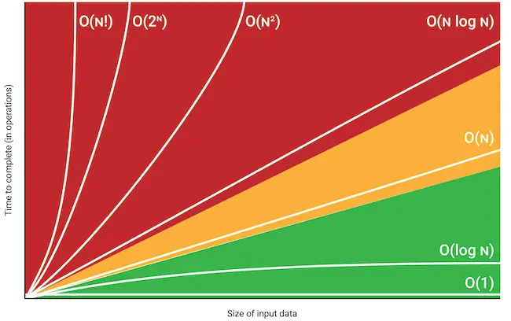

# Big-O Notation

## 알고리즘의 복잡도

알고리즘이 복잡한 정도는 크게 시간 복잡도와 공간 복잡도 두 가지로 나누어 볼 수 있다. 일반적으로 이 두 복잡도는 Trade-off 관계에 있다.
알고리즘의 복잡도가 높을수록 알고리즘을 구동하는데에 더 많은 비용이 소비된다.

### 공간 복잡도

알고리즘이 동작하기 위해 필요한 공간(메모리)의 크기이다. 공간 복잡도가 높을 경우 알고리즘이 동작하기 위해 더 많은 메모리를 소비한다.

### 시간 복잡도

간단하게 알고리즘이 동작하는 데에 걸리는 시간 또는 연산의 횟수이다. 2021년 기준으로는 예전보다 메모리 용량당 가격이 비교적 저렴해졌기 때문에 보통의 프론트엔드 개발에서는 공간 복잡도보다 시간복잡도를 더욱 신경쓰는 추세이다.

## Big-O Notation이란

Big-O는 시공간 복잡도를 수학적으로 표시하는 대표적인 방법이다. 알고리즘이 내부에서 어떠한 일을 하는지를 표시하는것이 아닌 input 데이터의 증가율에 따른 알고리즘의 성능을(논리적으로) 예측하기 위해 사용한다.
Big-O Notation에는 2가지 규칙이 있다.

- 가장 높은 차수만 남긴다.
  `O(n² + n) -> O(n²)`

- 계수 및 상수는 과감하게 버린다.
  `O(2n + 3) -> O(n)`

## Big-O Notation의 시간복잡도

  
<cite>사진 출처 - https://danielmiessler.com/study/big-o-notation/</cite>

- ### O(1) (Constant)

  input 데이터의 크기에 상관없이 언제나 일정한 시간이 걸리는 알고리즘을 나타낸다. 데이터의 크기가 얼마나 증가하든 성능에 영향을 거의 미치지 않는다.

- ### O(log₂ n) (Logarithmic)

  input 데이터의 크기가 커질수록 처리 시간이 로그(log: 지수 함수의 역함수)만큼 짧아지는 알고리즘이다. 보통 이진 탐색 알고리즘을 표현하는데 쓰인다. input 데이터의 크기가 2배 커지더라도 알고리즘의 연산 횟수는 1회밖에 증가하지 않는다. 예를 들어 32라는 input 데이터를 2로 몇번 나누어야 1이 되는가를 생각했을때 답은 5번이다. 이때 input 데이터를 2배인 64로 설정하면 똑같이 몇번 나누어야 1이 되는가를 생각하면 6번이다.

  하지만 대표적인 O(log₂ n)알고리즘인 이진 탐색은 정렬되지 않은 데이터에는 사용할 수 없고 만약 정렬이 필요하다면 그 알고리즘은 밑에서 얘기 할 JavaScript sort메서드의 시간복잡도인 O(n log n)이 될 수 있다. 이렇게 복잡도에는 trade-off 관계를 생각해야하는 경우도 많다.

- ### O(n) (Linear)

  input 데이터의 크기에 비례해 처리 시간이 증가하는 알고리즘이다. 예를 들어 input 데이터의 크기가 10배가 되면, 처리 시간도 10배가 된다. 선형 탐색 알고리즘이 대표적이다.

- ### O(n log n) (Linear-Logarithmic)

  input 데이터의 크기가 커질수록 처리시간이 로그(log)배 만큼 더 늘어나는 알고리즘이다. 예를 들어 데이터의 크키가 10배가 되면, 처리 시간은 약 20배가 된다. 정렬 알고리즘 Merge sort, Quick sort의 평균 시간 복잡도이다.

- ### O(n²) (quadratic)

  input데이터의 크기가 커질수록 처리시간이 급수적으로 늘어나는 알고리즘이다. 예를 들어 데이터의 크기가 10배가 되면, 처리 시간은 최대 100배가 된다. 이중 루프(n² matrix)가 대표적이다.

- ### O(2ⁿ) (Exponential)
  데이터량이 많아질수록 처리시간이 기하급수적으로 늘어나는 알고리즘이다. 대표적으로 피보나치 수열이 있다.
